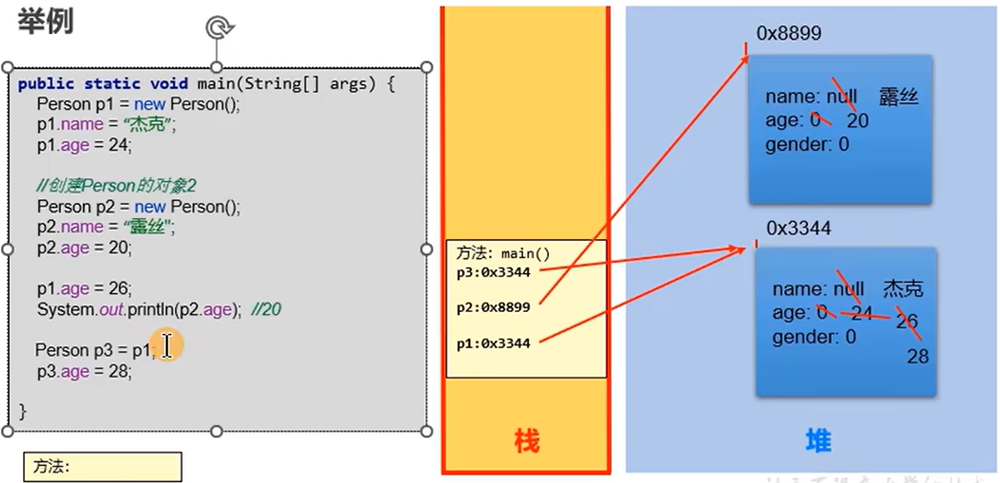
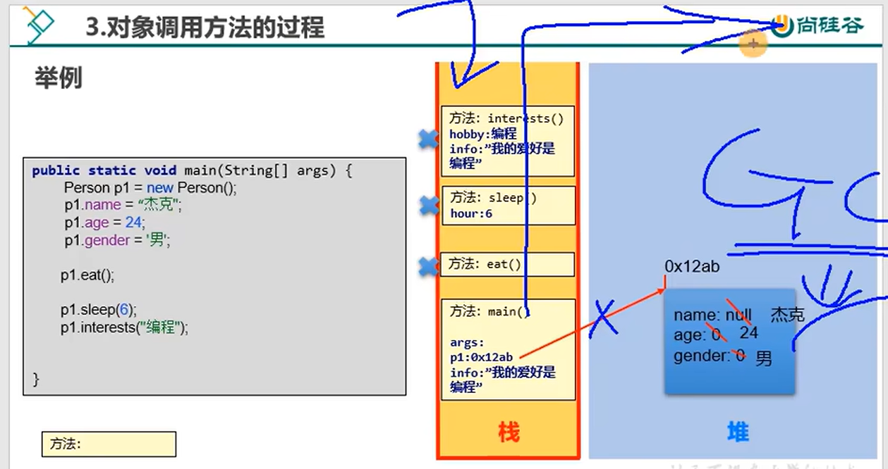

# Java SE 进阶篇

> 宋红康

## 第1章 概念

- **Java SE, Java EE, Java ME** 
  - **Java SE：**Java平台标准版。桌面级应用
  - **Java EE：**Java平台企业版。在 Java SE 的基础上构建，可以提供 Web 服务、组建模型、管理和通信API，可以用来实现企业级的面向服务的体系结构和 Web 应用程序。
  - **Java ME：**Java平台微型版。在移动设备和嵌入式设备上运行的应用程序提供一个健壮且灵活的环境。

- **JDK, JRE**

  - **JDK(Java Development Kit)**：Java 程序开发工具包，包含 JRE 和开发人员使用的工具。
  - **JRE(Java Runtime Enbironment)**：Java 程序的运行时环境，包含 JVM 和运行时所需要的核心库类。
  - **JDK = JRE + 开发工具集（如 Javac 编译工具等）**
  - **JRE = JVM + Java SE 标准库类**

  

- **Java 1.n 和 Java n.0 相同**

  > 按时间顺序， 1.1 - 1.4 版本有序，1.5 版本改动较大，改名直接叫做 5.0 版本，知道现在的 21.0 版本。所以 1.8 和 8.0 是一个意思。 其中 8, 11, 17 长期支持，8 的占用率很高。“你发任你发，我用 Java 8.” 但是 SpringBoot 3.0 要基于 Java 17 和 Spring 3.0，因此选择 17.

## 第2章 面向对象 - 基础

### 2.1 概述

- Java类和类的成员：**属性、方法、构造器**、代码块、内部类
- 面向对象的特征：封装、多态、继承、（抽象）
- 其他关键字：super, this, package, import, static, final, interface, abstract
- 成员一：属性（成员变量、field、字段、域）
- 成员二：方法

### 2.2 对象的内存解析

- 栈：方法内定义的变量（注意栈帧的概念）
- 堆：new 出来的结构（数组实体，对象实体），包括对象中的属性
- 方法区：存放类的模板（out文件夹里）



- **注意：**
  - 创建类的多个对象时，每个对象在堆空间中有一个对象实体。
  - p3 仅仅是一个新变量，指向了和 p1 相同的对象实体

### 2.3 属性相关

- **变量的分类**

  - 按照数据类型：基本数据类型（8 种），引用数据类型（数组、类、接口、枚举、注解、记录）
  - 按照变量在类中声明的位置不同：成员变量（即属性），局部变量（方法内，方法形参，构造器内）

- **成员变量和局部变量的相同点：**

  1. 声明格式相同

  2. 都有作用域

  3. 必须先声明，后赋值，再使用

- **成员变量和局部变量的不同点：**

  1. **声明的位置不同**
     - 属性：类内且方法外
     - 局部变量：方法（或构造器，代码块）中

  2. **在内存中的位置不同**

     - 属性：随着对象的创建，放在堆里面。

     - 局部变量：栈里。

  3. **生命周期不同**
     - 属性：随着对象的创建而创建；随着对象的消亡而消亡
     - 局部变量：随着方法对应的栈帧入栈，在栈中分配；随着方法对应的栈帧出栈，局部变量消亡。
  4. **作用域不同**
     - 属性：在类内部有效
     - 局部变量：仅限于声明在此局部变量所在的方法（或构造器，代码块）中
  5. **是否可以有权限修饰符来修饰**
     - 属性：可以使用权限修饰符（public, protected, 缺省, private）
     - 局部变量：不可以
  6. **是否有默认值**
     - 属性：都有默认初始化值
     - 局部变量：都没有默认初始化值

### 2.4 方法相关

#### 2.4.1 方法的内存解析

- 声明：权限修饰符 [其他修饰符] 返回值类型 方法名(形参列表) {}

- 方法可以调用本类内的方法

- 方法内不能定义类

- **方法内存解析：**

  

- **注意：**
  - 每调用一个方法，方法的栈帧就入栈
  - 方法内的局部变量也再栈帧中
  - 方法执行完即出栈，局部变量的生命周期也结束
  - main 的所有方法执行完，语句也结束，main 栈帧出栈
  - main 里的 p1 生命周期也结束，堆中的对象没有变量去指，垃圾回收期定期回收堆中的对象

#### 2.4.2 方法应用1：方法重载

- **方法重载：**在同一个类中，允许存在一个以上的同名方法，只要它们的参数列表不同即可（数量、类型或者顺序不同）
- **特点：**与修饰符、返回值类型无关，只关注参数列表。调用时，根据方法参数列表的不同来区别，
- **重载方法调用：**JVM通过方法的参数列表，调用匹配的方法。
  - 先找个数、类型完全相同的
  - 再找个数和类型可以兼容的，如果同时兼容多个方法将会报错

#### 2.4.2 方法应用2：可变个数形参的方法（JDK 5.0）

> 调用方法时，形参的类型确定，但是个数不确定
>
> JDBC 的 BaseDao 那里用到

```
// 语法
xxx fun(type ... paras){}

// 调用
fun();
fun(1);
fun(1,1,1);
fun(new int[]{1,1,1})	// @往下看
```

**注意：**

- 可以赋0个，1个，2个... ...值

- 可变个数形参的方法和同一个类中同名的方法也可以构成重载，JVM 还是先找完全相同的那个

- 特例：可变个数形参的方法和同一个类中同名且参数是相同类型的数组的方法不能构成重载

  ```
  // 特例！下面会报错，这俩语句，编译器认为完全相同（@往这看）
  xxx fun(type1 ... paras){}
  xxx fun(type1[] paras){}
  ```

- 可变个数的参数必须声明在形参列表的最后

- 可变个数的参数只能有一个

#### 2.4.3 方法应用3：方法的值传递机制

- 如果是基本数据类型的变量，则将此变量保存的数据值传递出去
- 如果是引用数据类型的变量，则将此变量保存的地址值传递出去（其实和上面一样，存啥传啥）
- 图解见 2.2 节的内存解析图
- **方法的值传递机制：值传递，不是引用传递**

#### 2.4.4 方法应用4：递归方法

- 直接递归：自己调用自己
- 间接递归：a调用b，b调用c，c又调用了a

### 2.5 package 和 import 关键字

#### 2.5.1 package

- **package（包）语句：**用于指明该文件中定义的类、接口等结构所在的包
- **注意：**
  - 一个源文件只能有一个package语句
  - 该语句在最开头，没有的是无名包
  - 包通常使用所在公司域名的倒置：com.alibaba.xxx，规定小写，见名知意
  - 取名不要使用 java.xxx
  - 点号 . 表明文件目录
  - 同一个包下可以定义多个类和接口，但不能定义同名的
- **作用：**
  - **划分项目层次**，便于管理
  - 帮助**管理大型软件**系统，功能相近的类在同一个包中，如 MVC 设计模式
  - 解决**类命名冲突**的问题
  - 控制**访问权限**

#### 2.5.2 import

- **import（导入）语句：**显式引入指定包下所需要的类，告诉编译器去哪找这个类

- **注意：**

  - 声明在包的生命和类的声明之间

  - 可以并列显式多个import语句

  - 使用 import java.util.*; 导入包下所有的结构（类、接口）

  - **lang 包下的可以不用 import，本包下的也不用 import**

  - 如果已经导入某包的所有类，它的子包下的类想要使用时还是要 import

  - 如果在代码中使用了不同包下的同名类，要使用类的全类名

  - **import static 组合的使用：调用指定类或接口下的静态的属性或方法**

    ```
    import static java.lang.System.out;
    ...
    out.println("Hello, world!");
    ```

    