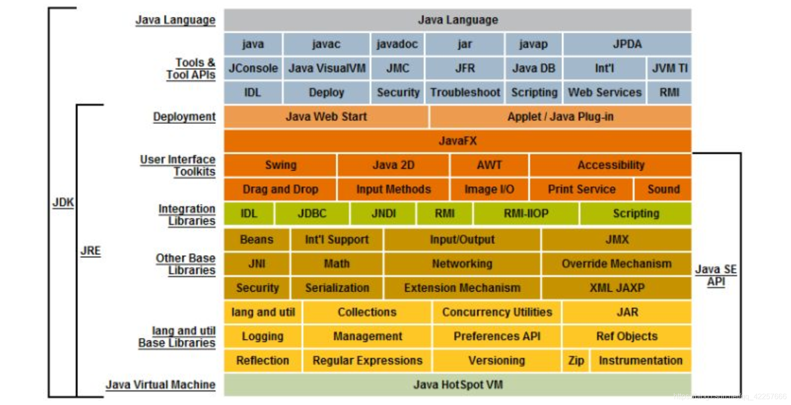
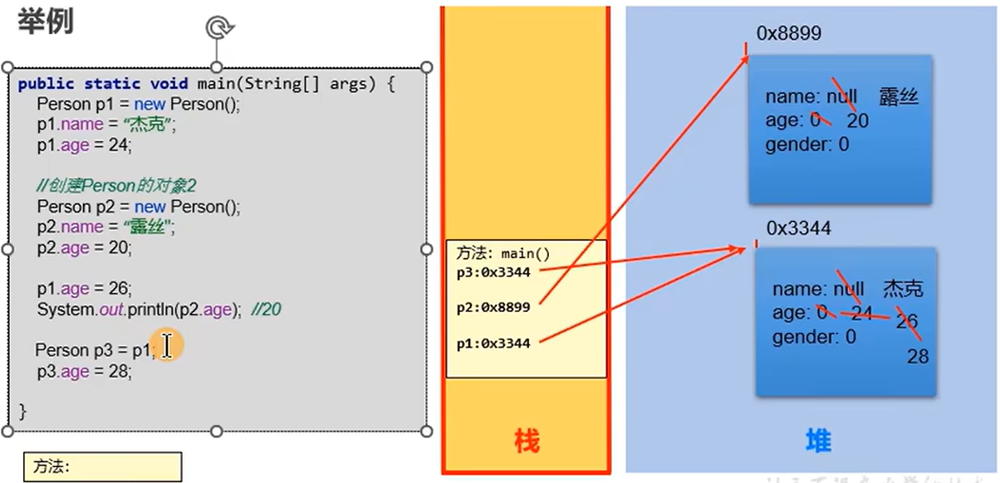
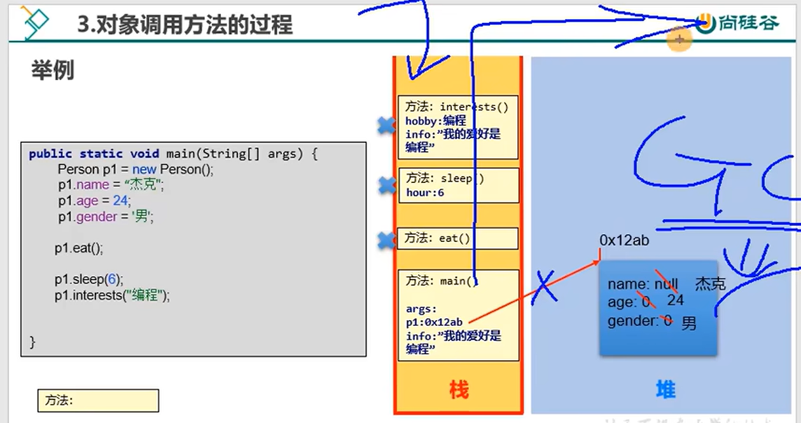
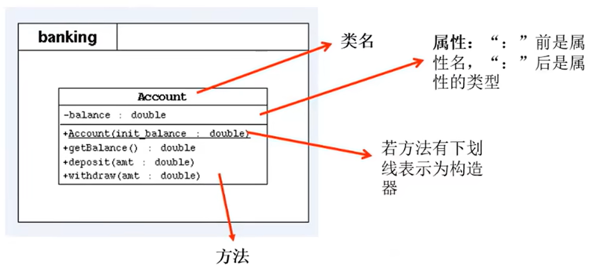

[TOC]


# Java SE 高级篇

> 宋红康

## 第1章 几个概念

- **Java SE, Java EE, Java ME** 
  - **Java SE：**Java平台标准版。桌面级应用
  - **Java EE：**Java平台企业版。在 Java SE 的基础上构建，可以提供 Web 服务、组建模型、管理和通信API，可以用来实现企业级的面向服务的体系结构和 Web 应用程序。
  - **Java ME：**Java平台微型版。在移动设备和嵌入式设备上运行的应用程序提供一个健壮且灵活的环境。

- **JDK, JRE**

  - **JDK(Java Development Kit)**：Java 程序开发工具包，包含 JRE 和开发人员使用的工具。
  - **JRE(Java Runtime Enbironment)**：Java 程序的运行时环境，包含 JVM 和运行时所需要的核心库类。
  - **JDK = JRE + 开发工具集（如 Javac 编译工具等）**
  - **JRE = JVM + Java SE 标准库类**

  

- **Java 1.n 和 Java n.0 相同**

  > 按时间顺序， 1.1 - 1.4 版本有序，1.5 版本改动较大，改名直接叫做 5.0 版本，知道现在的 21.0 版本。所以 1.8 和 8.0 是一个意思。 其中 8, 11, 17 长期支持，8 的占用率很高。“你发任你发，我用 Java 8.” 但是 SpringBoot 3.0 要基于 Java 17 和 Spring 3.0，因此选择 17.

## 第2章 面向对象 - 基础

### 2.1 概述

- Java类和类的成员：**属性、方法、构造器**、代码块、内部类
- 面向对象的特征：封装、多态、继承、（抽象）
- 其他关键字：super, this, package, import, static, final, interface, abstract
- 成员一：属性（成员变量、field、字段、域）
- 成员二：方法

### 2.2 对象的内存解析

- 栈：方法内定义的变量（注意栈帧的概念）
- 堆：new 出来的结构（数组实体，对象实体），包括对象中的属性
- 方法区：存放类的模板（out文件夹里）



- **注意：**
  - 创建类的多个对象时，每个对象在堆空间中有一个对象实体。
  - p3 仅仅是一个新变量，指向了和 p1 相同的对象实体

### 2.3 类的成员之一：属性

- **变量的分类**

  - 按照数据类型：基本数据类型（8 种），引用数据类型（数组、类、接口、枚举、注解、记录）
  - 按照变量在类中声明的位置不同：成员变量（即属性），局部变量（方法内，方法形参，构造器内）

- **成员变量和局部变量的相同点：**

  1. 声明格式相同

  2. 都有作用域

  3. 必须先声明，后赋值，再使用

- **成员变量和局部变量的不同点：**

  1. **声明的位置不同**
     - 属性：类内且方法外
     - 局部变量：方法（或构造器，代码块）中

  2. **在内存中的位置不同**

     - 属性：随着对象的创建，放在堆里面。

     - 局部变量：栈里。

  3. **生命周期不同**
     - 属性：随着对象的创建而创建；随着对象的消亡而消亡
     - 局部变量：随着方法对应的栈帧入栈，在栈中分配；随着方法对应的栈帧出栈，局部变量消亡。
  4. **作用域不同**
     - 属性：在类内部有效
     - 局部变量：仅限于声明在此局部变量所在的方法（或构造器，代码块）中
  5. **是否可以有权限修饰符来修饰**
     - 属性：可以使用权限修饰符（public, protected, 缺省, private）
     - 局部变量：不可以
  6. **是否有默认值**
     - 属性：都有默认初始化值
     - 局部变量：都没有默认初始化值

### 2.4 类的成员之二：方法

#### 2.4.1 方法的内存解析

- 声明：权限修饰符 [其他修饰符] 返回值类型 方法名(形参列表) {}

- 方法可以调用本类内的方法

- 方法内不能定义类

- **方法内存解析：**

  

- **注意：**
  - 每调用一个方法，方法的栈帧就入栈
  - 方法内的局部变量也再栈帧中
  - 方法执行完即出栈，局部变量的生命周期也结束
  - main 的所有方法执行完，语句也结束，main 栈帧出栈
  - main 里的 p1 生命周期也结束，堆中的对象没有变量去指，垃圾回收期定期回收堆中的对象

#### 2.4.2 方法应用1：方法重载

- **方法重载：**在同一个类中，允许存在一个以上的同名方法，只要它们的参数列表不同即可（数量、类型或者顺序不同）
- **特点：**与修饰符、返回值类型无关，只关注参数列表。调用时，根据方法参数列表的不同来区别，
- **重载方法调用：**JVM通过方法的参数列表，调用匹配的方法。
  - 先找个数、类型完全相同的
  - 再找个数和类型可以兼容的，如果同时兼容多个方法将会报错

#### 2.4.2 方法应用2：可变个数形参的方法（JDK 5.0）

> 调用方法时，形参的类型确定，但是个数不确定
>
> JDBC 的 BaseDao 那里用到

```
// 语法
xxx fun(type ... paras){}

// 调用
fun();
fun(1);
fun(1,1,1);
fun(new int[]{1,1,1})	// @往下看
```

**注意：**

- 可以赋0个，1个，2个... ...值

- 可变个数形参的方法和同一个类中同名的方法也可以构成重载，JVM 还是先找完全相同的那个

- 特例：可变个数形参的方法和同一个类中同名且参数是相同类型的数组的方法不能构成重载

  ```
  // 特例！下面会报错，这俩语句，编译器认为完全相同（@往这看）
  xxx fun(type1 ... paras){}
  xxx fun(type1[] paras){}
  ```

- 可变个数的参数必须声明在形参列表的最后

- 可变个数的参数只能有一个

#### 2.4.3 方法应用3：方法的值传递机制

- 如果是基本数据类型的变量，则将此变量保存的数据值传递出去
- 如果是引用数据类型的变量，则将此变量保存的地址值传递出去（其实和上面一样，存啥传啥）
- 图解见 2.2 节的内存解析图
- **方法的值传递机制：值传递，不是引用传递**

#### 2.4.4 方法应用4：递归方法

- 直接递归：自己调用自己
- 间接递归：a调用b，b调用c，c又调用了a

### 2.5 关键字 package 和 import

#### 2.5.1 关键字 package

- **package（包）语句：**用于指明该文件中定义的类、接口等结构所在的包
- **注意：**
  - 一个源文件只能有一个package语句
  - 该语句在最开头，没有的是无名包
  - 包通常使用所在公司域名的倒置：com.alibaba.xxx，规定小写，见名知意
  - 取名不要使用 java.xxx
  - 点号 . 表明文件目录
  - 同一个包下可以定义多个类和接口，但不能定义同名的
- **作用：**
  - **划分项目层次**，便于管理
  - 帮助**管理大型软件**系统，功能相近的类在同一个包中，如 MVC 设计模式
  - 解决**类命名冲突**的问题
  - 控制**访问权限**

#### 2.5.2 关键字 import

- **import（导入）语句：**显式引入指定包下所需要的类，告诉编译器去哪找这个类

- **注意：**

  - 声明在包的生命和类的声明之间

  - 可以并列显式多个import语句

  - 使用 import java.util.*; 导入包下所有的结构（类、接口）

  - **lang 包下的可以不用 import，本包下的也不用 import**

  - 如果已经导入某包的所有类，它的子包下的类想要使用时还是要 import

  - 如果在代码中使用了不同包下的同名类，要使用类的全类名

  - **import static 组合的使用：调用指定类或接口下的静态的属性或方法**

    ```
    import static java.lang.System.out;
    ...
    out.println("Hello, world!");
    ```


#### 2.6 面向对象的特征之一：封装性

- **概念：**
  - 把客观的事物封装成抽象的类，并且类可以把自己的数据和方法只向可信的类或者对象开放，向没必要开放的类或者对象隐藏信息。**该隐藏的隐藏，该暴露的暴露**

- **作用：**
  - **高内聚：**类的内部数据操作细节自己完成，不允许外部干涉。
  - **低耦合：**仅暴露少量的方法给外部使用，尽量方便外部调用。

- **如何实现：权限修饰符**

  - private, 缺省, protected, public

  - 可以用4中权限修饰符来修饰类及类的内部成员，当这些成员被调用时，体现可见性的大小。、

    | 修饰符    | 本类内部 | 本包内 | 其他包的子类 | 其他包的非子类 |
    | --------- | -------- | ------ | ------------ | -------------- |
    | private   | √        | ×      | ×            | ×              |
    | 缺省      | √        | √      | ×            | ×              |
    | protected | √        | √      | √            | ×              |
    | public    | √        | √      | √            | √              |

  - **外部类只能只用public，缺省来修饰；类的内部成员4中都可以用。**

- **举例：**

  > 给Animal的对象的legs属性赋值，如果直接调用，可以赋值负数，不符合常识，所以将legs私有化（private修饰）禁止在Animal类的外部直接调用此属性。提供赋值方法setLegs()，其中可以加入判断逻辑。提供获取方法getLegs()，供外部调用。

  - 私有化类的属性，对外提供set和get方法

  - 将类中不需要对外暴露的方法，用private修饰
  - 单例模式中，构造器声明称private，避免在类的外部创建实例

### 2.7 类的成员之三：构造器

- **作用：**	
  - 搭配new关键字，创建类的对象
  - 在创建对象的同时，给对象的相关属性赋值
- **使用说明:**
  - 格式：权限修饰符 类名(形参列表) {}
  - 创建类之后，在没有显式提供任何构造器的情况下，系统会默认提供一个空参的构造器，该构造器权限与类声明的权限相同。
  - 一旦类中显式地声明了构造器，系统不再提供默认的空参构造器
  - 一个类中可以声明多个构造器，彼此之间构成重载
- 匿名对象：
  - 往往只能调用一次
  - 常常作为实参赋值给方法的实参
  - 当然在赋值给的方法内部是有名字的，可以多次调用

### 2.8 补充内容

#### 2.8.1 属性（仅考虑实例变量，不考虑类变量）赋值过程

- **在类中，哪里可以给属性赋值？**

  1. 默认赋值

  2. 显式赋值

  3. 构造器中赋值

  4. 通过 对象.方法 赋值
  5. 通过 对象.属性 赋值（需要权限允许）

- **顺序：**
  - 1 -> 2 -> 3 -> 4 / 5

#### 2.8.2 JavaBean

> JavaBean 是一种 Java 语言写成的可重用组件

- **符合以下标准的 Java 类：**
  - 类是公共的
  - 有一个无参的公共的构造器
  - 有属性，且有对应的 get, set 方法

#### 2.8.3 UML 类图

- **UML(Unified Modeling Language，统一建模语言)：**用来描述软件模型和架构的图形化语言

- 常用的UML工具软件有：PowerDesigner ...

- 要看懂UML类图

  

## 第3章 面向对象 - 进阶

### 3.1 关键字 this 调用属性、方法、构造器

#### 3.1.2 关键字 this 调用属性、方法

>this的理解：当前对象（在方法中调用时），或当前正在创建的对象（在构造器中调用时）

- **针对于非static修饰的方法内使用情况：**
  - 通过对象a调用方法，可以在方法内调用当前对象a的属性或其他方法，此时可以在属性或其他方法前使用this，表示当前属性或方法所属的对象a，但是一般省略次this
  - 特殊情况下，方法的形参与对象的属性重名，必须用this.
- **针对于构造器内使用情况：**
  - 使用构造器实例化对象时，同上

#### 3.1.3 关键字 this 调用构造器

- 我们使用 this(形参列表); 调用指定的构造器

- 可以在类的构造器中，可以调用本类中的其他构造器

- this(形参列表); 必须放在当前构造器的首行，且最多一个

- 一个类中声明了n个构造器，其中最多n-1个构造器中有 this(参数列表);

  ```
  public User() {
  	// 很多行代码
  }
  
  public User(String name) {
  	this();
  	this.name = name;
  }
  
  public User(String name, int age) {
  	this(name);
  	this.age = age;
  }
  ```

### 3.2 面向对象的特征之二：继承性

> 默认的父类：java.lang.Object

- **好处：**
  - 减少了代码的冗余，提高了代码的复用性
  - 有利于功能的扩展
  - 继承的出现，产生了 is-a 关系，为多态的使用提供了前提（Student is a Person）

- **格式：**

  ```
  class A {
  	// 属性，方法
  }
  
  class B extends A {
  
  }
  ```

- **基本概念：**

  - 类A：父类，超类，基类
  - 类B：子类，派生类

- **作用：**

  - 子类获取了父类中声明的**所有属性和方法**
  - 但是由于封装性的影响，**可能子类不能直接调用父类中的属性和方法**（private，缺省的情况，只能用get方法获取）
  - 子类在继承父类之后，还可以扩展自己特有的功能

- **补充说明：**

  - 可以多层继承（直接继承，间接继承）
  - 一个父类可以有多个子类
  - 一个子类只能有一个父类（接口可以有多个父类）

### 3.3 方法重写

- **概念：**
  - 子类继承父类后，继承了父类中声明的所有方法，但父类中的方法可能不太适合于子类，所以需要覆盖、覆写

- **规则：**
  - **父类被重写的方法与子类重写的方法，方法名和形参列表必须相同**
  - 子类重写的方法的权限修饰符不小于父类被重写的权限修饰符
  - 子类不能重写父类中声明为private权限修饰的方法
  - 关于返回值类型：
    - 父类被重写的方法的返回类型是void：子类重写的方法的返回值类型也必须是void
    - 父类被重写的方法的返回类型是基本数据类型：子类重写的返回值类型必须与之相同
    - 父类被重写的方法的返回类型是引用数据类型：子类重写的返回值类型可以与之相同或是其子类
  - 子类重写的方法抛出的异常类型可以与父类被重写的方法抛出异常的类型相同，或是其子类

### 3.3 关键字 super

> 问题1：子类重写了父类的方法之后，是否还可以调用父类被重写的方法？
>
> 问题2：子类定义了与父类同名的属性，如何区分两个属性？（属性不会重写，方法才会）
>
> super：父类的。可以解决上面两个问题

#### 3.3.1 关键字 super 调用属性、方法

> 子类继承父类后，可以在子类的方法或构造器中调用父类声明的属性或方法，一般情况下省略super，除非重写且想调用父类的方法。

#### 3.3.2 关键字 super 调用构造器

- 子类继承父类时，不会继承父类的构造器，只能通过 super(形参列表) 的方式调用父类指定的构造器
- super(形参列表) 必须生命在构造器的首行
- 由于 this(形参列表) 也必须在首行，所以 this(形参列表) 和 super(形参列表) 只能有一个
- 如果在子类构造器的首行既无 this(形参列表) 又无 super(形参列表)，则子类此构造器默认调用 super()，即调用父类中的空参构造器
- 子类的任何一个构造器，要么调用本类重载的构造器，要么调用父类的构造器
- 一个类中声明有n个构造器，其中最多n-1个使用了this(形参列表) ，剩下的一个一定使用 super(形参列表)  

#### 3.3.3 子类对象实例化的全过程

> 当通过子类的构造器创建对象时，子类的构造器一定会直接或间接地调用其父类的构造器，而其父类的构造器同样会直接或间接地再调用父类构造器... ... 直到调用了 Object 类中的构造器为止。

### 3.4 面向对象的特征之三：多态性

```
Person p = new Student();
public void adopt(Animal animal);	// 可以传入 Cat, Dog ...
```

- **概念：父类的引用指向子类的对象（子类的对象赋给父类的引用）。**

- **应用：**

  - **虚（拟）方法调用：**编译时，认为方法是上面左侧声明的父类的被重写的方法；执行时，执行的是右边子类重写的方法。

    ```
    p.eat();	// 调用的是Student类的方法
    p.walk();	// 调用的是Student类的方法
    ```

- **前提：**

  - 要有类的**继承**关系
  - 要有方法的**重写**

- **适用性：虚方法调用的概念，仅适用于方法，不适用于属性**

- **优点：**极大地减少了代码的冗余，不需要定义多个重载的方法
- **弊端：**在多态的场景下，创建了子类的对象，也加载了子类特有的属性和方法，但是由于声明为了父类的引用，导致无法直接调用子类特有的这些属性和方法。如：内存中加载了 Student|Cat|Dog 中特有的属性和方法，但是不能直接调用这些属性和方法

### 3.5 向下转型

- **向上转型：多态**

- **向下转型：使用强制符**

  ```
  Person p = new Student();	// 向上转型
  Student t = (Student)p;		// 向下转型，t, p 指向堆空间中同一个对象
  ```

- **可能出现类型转换异常**

  ```
  // 问题出现
  Person p = new Man();
  Woman w = (Woman)p;			// 类型转换异常
  ```

  ```
  // 问题解决
  Person p = new Man();
  if (p instanceof Woman) {
  	Woman w = (Woman)p;		// 不执行 
  }
  ```

### 3.6 Object 类以及 clone(), finalize() 的理解

#### 3.6.1 Object 类

> 类 java.lang.Object 是类层次结构的根类，是所有其他类的父类。
>
> Object 类中声明的结构（属性，方法）就具有通用性

- Object 类中没有声明属性
- Object 类提供了一个空参构造器
- Object 类中的 11个 方法是重点
  - **重点方法：equals(), toString**
  - **了解方法：clone(), finalize()**
  - 目前不看：getClass(), hashCode(), notify(), notifyAll(), wait(), wait(x), wait(x,y)

#### 3.6.2 clone()

> 在堆空间中创建了一个新的克隆出来的对象

```
Animal a2 = (Animal)a1.clone();
```

#### 3.6.3 finalize()（9版本后不建议使用）

> 当GC要回收此对象时，调用此方法
>
> 子类可以重写此方法，在释放对象前做某些操作。通常是检查资源是否释放，或者手机填表中途退出，finalize() 告诉GC不要回收该表单对象，使得返回填表能保留已经填好的信息。
>
> 可能导致内部出现循环引用，导致此对象不能被正常回收

### 3.7 equals() 的使用

- **定义**

```
// 在 Object 类中的定义
public boolean equals(Object obj) {
	return (this == obj)
}
```

- **说明：**
  - 在没有重写的情况下，比较两个引用指向的在堆中的对象是否是同一个
  - String 重写了这个方法，比较的是指向的内容是否相同（说白了俩字符串长得一样就行）
  - 还有 File, Date 和包装类等，都重写了这个方法，比较两个对象实体的内容是否相同
  - 写自定义类时，idea 可以自动生成重写的 equals 方法
- **区分 ==  和 equals()**
  - 概念不同：运算符|方法
  - 使用范围不同：基本数据类型，引用数据类型|引用数据类型
  - 提一下 equals() 重写的事情

### 3.8 toString() 的使用

```
// 在 Object 类中的定义
public String toString() {
	return getClass().getName() + "@" + Integer.toHexString(hashCode());
}
```

- 在调用System.out,println()打印对象的引用变量时，其实就调用了对象的toString()，理解为返回地址值
- String, File, Date或包装类等Object的子类，都重写了这个方法，返回的是实体内容

## 第4章 面向对象 - 高级

### 4.1 关键字 static 修饰属性、方法

#### 4.1.1 关键字 static 修饰变量

- **static（静态的）：**用来修饰的结果：属性、方法、代码块、内部类
- **静态变量与实例变量对比：**
  1. 定义
     - 静态变量：被static修饰，也叫类变量
     - 实例变量：没有被static修饰，也叫非静态变量
  2. 个数：
     - 静态变量：在内存空间中只有1个
     - 实例变量：每个实例1个
  3. 内存位置：
     - 静态变量：JDK 6 之前存放在方法区；JDK 7及之后存放在对空间
     - 实例变量：存放在对空间的对象实体中
  4. 加载时机：
     - 静态变量：随着类的加载而加载，因为类只加载一次，所以只有一个
     - 实例变量：随着对象的创建而创建，可以有多个
  5. 调用者：
     - 静态变量：类或对象
     - 实例变量：对象
  6. 消亡时机：
     - 静态变量：随着类的卸载而消亡
     - 实例变量：随着对象的消亡而消亡

#### 4.1.2 关键字 static 修饰方法

> 随着类的加载而加载，可以通过“类.静态方法”的方式，直接调用静态方法

- **静态方法内可以调用静态的属性或方法，不能调用非静态的属性或方法（想想生命周期，而且可能用类来调用）**
- 非静态方法内可以调用静态的属性或方法，也可以调用非静态的属性或方法

- static 修饰的方法内，不能出现this和super
- 能共享的，常量等设置为静态变量
- **方法内操作的变量如果都是静态变量，则此方法建议声明为静态方法**
- **常常将工具类中的方法声明为静态方法，如Array, Math**

### 4.2 单例设计模式

> 设计模式是在大量的实践中总结和理论化之后优选的代码结构、编程风格以及解决问题的思考方式。类似于“棋谱”，“套路”。经典的共有23种

- **概念：**采取一定的方法，保证在整个软件系统中，对某个类只能存在一个对象实例，并且该类只提供一个取得其对象实例的方法。

- **实现思路：**类的**构造器设置为private**，这样就不能new了，但是类内部仍可以产生该类的对象。由于在类的外部还无法得到类的对象，所以只能**调用该类的静态方法**以返回类内部创建的对象，而静态方法只能访问类中的静态成员变量，所以指向类内部产生的**该类对象的变量也必须定义成静态的**。goodgood

- **实现：**

  ```
  // 单例设计模式实现1：饿汉式
  package com.oop;
  
  public class BankTest {
      public static void main(String[] args) {
          Bank bank1 = Bank.getInstance();
      }
  }
  
  class Bank {
      private Bank() {}
  
      private static Bank instance = new Bank();
  
      static public Bank getInstance() {
          return instance;
      }
  }
  ```

  ```
  // 单例设计模式实现2：懒汉式
  package com.oop;
  
  public class GFTest {
      public static void main(String[] args) {
          
      }
  }
  
  class GF {
      private GF() {}
      
      static private GF instance = null;
      
      static public GF getInstance() {
          if (instance == null) {
              instance = new GF();
          }
          return instance;
      }
  }
  ```

  - 饿汉式：“立即加载”，随着类的加载，当前的唯一实例就创建了
  - 懒汉式：“延迟加载”，在需要使用的时候才创建

- 优缺点：

  - 饿汉式：（优点）写法简单，由于内存中较早加载所以使用更快更方便，线程安全；（缺点）内存中占用时间较长。
  - 懒汉式：（优点）线程不安全（if 语句可能被多个线程进入）；（优点）在需要的时候创建，节约内存空间。

### 4.3 main() 方法

#### 4.3.1 关键字说明

```
public class GameAPP {
    public static void main(String[] args) {
        new GameFrame();
    }
}

```

- **public：**权限大
- **public：**psvm本身就是程序入口，不能指望再去创建实例去调用，所以将其声明为类方法。
- **void：**无接受者
- **main：**程序入口

#### 4.3.2 理解

1. 可以看作一个普通的静态方法，所以一个Java文件其实可以出现多个，格式也可以变成private
2. 可以看作是程序的入口，格式固定，必须是psvm

#### 4.3.3 参数列表 String[] args

- 与控制台交互：使用 main() 方法的形参传值

- idea 中：run -> Edit Configurations -> 输出传入参数

### 4.4 类的成员之四：代码块

- **作用：**用来初始化类或对象的信息（即初始化类或对象的成员变量）
- **代码块的修饰：**可以使用static修饰
  - 静态代码块
  - 非静态代码块
- **静态代码块：**
  - 随着类的加载而执行
  - 由于类的加载只会进行一次，静态代码块也只会执行一次
  - **作用：初始化类的信息**
  - 内部可以声明变量、调用属性方法等
  - 先执行
  - 如果有多个，按照声明的顺序执行，一般不会有多个
  - 内部只能调用静态的结构，即静态属性和方法
- **非静态代码块：**
  - 随着对象的创建而执行
  - 每创建当前类的一个实例，就会执行一次非静态代码块
  - **作用：初始化对象的信息**
  - 内部可以声明变量、调用属性方法等
  - 后执行
  - 如果有多个，按照声明的顺序执行，一般不会有多个
  - 内部可以调用静态的结构，也可以调用非静态的结构

### 4.5 类中属性赋值的位置及过程

- 可以给非静态的属性（实例变量）赋值的位置有：
  1. 默认初始化
  2. 显示初始化
  3. 构造器中初始化
  4. ”对象.属性“的方式赋值
  5. “对象.方法“的方式赋值
  6. 代码块中初始化
  7. **顺序是1 -> 2 / 6 -> 3 -> 4 / 5**

### 4.6 关键字 final 的使用

- 可以用来修饰的结构：类，方法，变量
- 具体说明：
  - **修饰类：此类不能被继承**
  - **修饰方法：此方法不能被重写**
  - **修饰变量：既可以修饰成员变量，又可以修饰局部变量。变量成为了常量，一旦赋值，不可更改**
- final 与 static 搭配修饰成员变量，此成员变量称为**“全局常量”**

### 4.7 面向对象的特征之四：抽象性

#### 4.7.1 引入

>几何图形类有许多子类，每个子类都要求周长、面积，但是求法都不同，这样在几何图形类里定义方法就没有意义了，而只是有一个抽象的方法，具体实现则让子类去实现（重写）。下面的例子也可以凑合看一下。

**Person.java**

```
package com.oop;

public abstract class Person {
    String name;
    int age;

    public Person(){}
    public Person(String name, int age) {
        this.name = name;
        this .age = age;
    }

    public abstract void eat();

    public abstract void sleep();
}

```

**Student.java**

```
package com.oop;

public class Student extends Person{
    String school;
    public Student() {
    }
    public Student(String name, int age, String school) {
        super(name,age);
        this.school = school;
    }

    public void eat() {
        System.out.println("学生吃饭");
    }

    public void sleep() {
        System.out.println("学生睡觉");
    }
}
```

**AbstractTest.java**

```
package com.oop;

public class AbstractTest {
    public static void main(String[] args) {
//        Person person1 = new Person();
//        person1.eat();
        Student student1 = new Student();
        student1.eat();
    }
}
```

#### 4.7.2 abstract 修饰类和方法

- 修饰类：
  - 此类称为抽象类
  - 抽象类不能被实例化
  - 抽象类包含构造器，因为子类对象实例化时需要直接或者间接使用
  - 抽象类中可以没有抽象方法，抽象方法所在的类一定是抽象类
- 修饰方法：
  - 此方法称为抽象方法
  - 抽象方法只有方法的声明，没有方法体（甚至没有中括号）
  - 抽象方法功能是确定的，见名知意
  - 子类必须重写父类的所有抽象方法之后才能实例化，否则还是抽象类
- 不能修饰属性，构造器，代码块
- 不能用abstract修饰私有方法，静态方法，final方法，final的类

#### 4.7.3 模板方法设计模式

> 当功能内部一部分是确定的，另一部分是不确定的，可以把不确定的部分暴露出去，让子类去实现。换句话说，在软件开发中实现一个算法时，整体步骤很固定、通用，这些步骤已经在父类当中写好了，但是某些地方易变，易变部分可以抽象出来，供不同子类实现，这就是模板方法设计模式。

### 4.8 接口 interface

#### 4.8.1 接口概念

- **接口：**是规范，是一组规则，体现了现实世界中“如果你是/要...则必须能...”的思想。继承是是不是的 is - a 关系，接口则是能不能的 has - a 关系

- **说明：**

  - 接口内可以声明属性：**必须使用 public static final 修饰**

  - 接口内可以声明方法： **JDK 8 之前，声明抽象方法，修饰为 public abstract**

    ​										JDK 8 声明静态方法（只能被接口调用，不能被实现类调用）和默认方法（可以被实现类继承和重写）

    ​										JDK 9 声明私有方法

  - 接口内不可以声明构造器

- **格式：**class A extends SuperA implements B, C{}
- **注意：**
  - A 相较于 B, C，叫做实现类
  - 类可以实现多个接口
  - 类对于接口的多实现，一定程度上弥补了类的单继承的局限性
  - 类必须将实现的接口中的所有抽象方法都重写（实现），才可以实例化；否则此类还是抽象类
  - **接口和接口之间可以继承，且可以多继承**
- **接口的多态性：Flyable f = new Bullet();**

```
package com.oop;

public class InterfaceTest {
    public static void main(String[] args) {
        Flyable f = new Bullet();
    }
}

interface Flyable {
    // 全局常量
    public static final int MIN_SPEED = 0;

    // 不显式声明public static final也默认是全局常量
    int MAX_SPEED = 7900;

    // 同样可以省略public abstract声明
    void fly();
}

interface Attackable {
    void attack();
}

abstract class Plane implements Flyable{

}

class Bullet implements Flyable,Attackable{

    @Override
    public void fly() {
        System.out.println("让子弹飞");
    }

    @Override
    public void attack() {
        System.out.println("子弹打人");
    }
}


// ---------------------------------接口的多继承------------------------------------
interface AA{
    void method1();
}

interface BB{
    void method2();
}

interface CC extends AA,BB{

}

class DD implements CC{

    @Override
    public void method1() {

    }

    @Override
    public void method2() {

    }
}
```

#### 4.8.2 区分抽象类和接口

- **共性：**
  - 都可以声明抽象方法
  - 都不能实例化
- **不同：**
  - 抽象类有构造器，接口没有构造器
  - 类与类之间继承关系，类与接口是实现关系，接口与接口之间是多继承关系

#### 4.8.3  JDK 8 和 JDK 9 中关于接口的新特性

> JDK 8 声明静态方法（只能被接口调用，不能被实现类调用）和默认方法（可以被实现类继承和重写），子类继承了父类并实现了接口，父类和接口中声明了同名同参数的方法（其中接口中是默认方法），子类在没有重写该方法的情况下，有限调用父类的方法，而非接口的方法。

>JDK 9 可以声明私有方法，供接口中静态方法和默认方法调用

### 4.9 类的成员之五：内部类

#### 4.9.1 概念

- **定义：**将一个类A定义在另一个类B里面，里面的那个类A就称为内部类，类B称为外部类
- **作用：**当一个事务A的内部，还有一个部分需要一个完整的结构B进行描述，而这个**内部的完整结构B又只为外部事物A提供服务**，不在其他地方单独使用，那么整个内部的完整结构B最好使用内部类。

- **举例：**Thread类内部声明了State类，表示线程的生命周期。HashMap类中声明了Node类，表示封装的key和value
- **内部类的分类：**
  - 成员内部类：直接声明在外部类的里面
    - 使用static修饰的：静态成员内部类
    - 不使用static修饰的：非静态成员内部类
  - 局部内部类：声明在方法内、构造器内、代码块内的内部类
    - 匿名的局部内部类
    - 非匿名的局部内部类

#### 4.9.2 成员内部类

- 内部可以声明5种结构
- 此内部类可以继承父类，实现接口
- 可以使用final修饰
- 可以使用abstract修饰
- 内部可以调用外部类的结构（属性、方法）
- 除了使用public、缺省修饰之外，还可以使用private、proteed修饰
- 可以使用static修饰

```
package com.oop;

public class OuterClassTest {
    public static void main(String[] args) {
        // 静态内部类的实例化
        Person.Dog dog = new Person.Dog();

        // 非静态内部类的实例化
        Person p1 = new Person();
        Person.Bird bird = p1.new Bird();
        bird.show("参数");
    }
}

class Person {
    private String name = "李明";
    // 静态成员内部类
    static class Dog{}

    // 非静态成员内部类
    class Bird {
        String name = "啄木鸟";
        public void show(String name) {
            System.out.println(name);               // 参数name
            System.out.println(this.name);          // 本类的name：啄木鸟
            System.out.println(Person.this.name);   // 外部类的name
        }
    }

    // 局部内部类
    public void method() {
        class InnerClass1{}
    }

    // 局部内部类
    public Person() {
        class InnerClass1 {}
    }

}
```

#### 4.9.3 局部内部类

```
package com.oop;

public class OuterClassTest1 {
    // 提供实现Comparable接口的类
    // 方式1：提供了接口的实现类的匿名对象
    public Comparable getInstance1(){
        class MyComparable1 implements Comparable{
            @Override
            public int compareTo(Object o) {
                return 0;
            }
        }
        return new MyComparable1();
    }
    
    // 方式2：提供了接口的匿名实现类的有名对象
    public Comparable getInstance2(){
        Comparable comparable = new Comparable() {
            @Override
            public int compareTo(Object o) {
                return 0;
            }
        };
        return comparable;
    }
    
    // 方式3：提供了接口的匿名实现类的匿名对象
    public Comparable getInstance3() {
        return new Comparable() {
            @Override
            public int compareTo(Object o) {
                return 0;
            }
        };
    }
}
```

## 第5章 注解 annotation

 ### 5.1 定义

> 注解是从JDK 5.0开始引入，以@注释名在代码中存在例如：

```
@Override
@Deprecated
@SuppressWarning(value="unchecked")
```

- Annotation 可以像修饰符一样被使用，可用于修饰包、类、构造器、方法、成员变量、参数、局部变量的声明。
- 还可以添加一些参数值，这些信息保存在注解的"name=value"对中
- 注解可以在类编译、运行时加载，体现不同的功能

### 5.2 注解与注释

- 注解可以看作一种注释，通过注解，在不改变原有代码逻辑的情况下，在源文件中插入补充信息
- 注释是给程序员看的
- 注解可以被编译器或其他程序读取。程序还可以根据注解的不同，作出相应的处理。

### 5.3 注解的重要性

- Java SE 中：使用注解的目的简单，如标记过时的功能，忽略警告
- **Java EE / Android 中：注解更加重要，如配置应用程序的任何切面，代替Java EE旧版中遗留的繁冗代码和XML配置**（？）
- Spring 2.5 以上是基于注解的。**框架 = 注解 + 反射 + 设计模式**

### 5.4 常见的注解（JDK 内置的3个基本注解）

- @Override: 重写
- @Deprecated: 不推荐使用的，废弃的方法
- @SuppressWarnings("all"): 镇压警告，原警告不报

### 5.5 自定义注解

```
public @interface MyAnnotation {
	String value() default "hello";
}
```

### 5.5 常见的元注解

- **元注解：对现有的注解进行解释说明的注解，即注解注解的注解**

- @Target：表示注解的注解能注解的范围（语文老师直呼内行）
- @Retention：用于描述注解注解的生命周期，可以通过枚举类型RetentionPolicy的3个常量来指定：SOURCE（截止到源代码）, CLASS（截止到字节码）, RUNTIME（直到运行时），唯有RUNTIME阶段才能被反射读取到（？）
- @Documented：表示注解的注解应该被javadoc工具记录
- @Inherited：允许子类继承父类中的注解

## 第6章 集合框架（集合类）

### 6.1 概念

- **内存层面**需要针对多个数据进行存储时，可以考虑的容器有：数组、集合类
- 数组存储多个数据的特点：
  - 数据一旦初始化，其长度就是确定的
  - 数组中的多个元素是依次紧密排列的，有序的，可重复的
  - 数组中可用的方法、属性极少
  - 数组一旦初始化完成，其元素的类型就是确定的
  - 元素的类型既可以是基本数据类型，又可以是引用数据类型
  - 删，查性能差

### 6.2 Java 集合框架体系

1. 接口 java.util.Collection：存储一个一个的数据，子接口有：

   - 子接口 java.util.Collection.List：存储有序的、可重复的数据，实现类有：（动态数组）
     - ArrayList
     - LinkedList
     - Vector

   - 子接口 java.util.Collection.Set：存储无序的、不可重复的数据，实现类有：
     - HashSet
     - LinkedHashSet
     - TreeSet

2. 接口 kava.util.Map：存储一对一对的数据，实现类有：

   - HashMap

   - LinkedHashMap

   - TreeMap

   - Hashtable

   - Properties

### 6.3 刷力扣再补充（？）

## 第7章 泛型（JDK 5.0）

### 7.1 概念

> 所谓泛型，就是允许在定义类、接口时通过一个“标识”表示类中某个“属性的类型”或者是某个方法的“返回值或参数的类型”。这个类型参数将在使用时（如：继承或实现这个接口、创建对象或调用方法时）确定，即传入实际的类型参数，也称为类型实参。

- 在集合框架中使用泛型之前可能存在的问题：

  - 类型不安全，add()的参数是object类型，啥都能放进去
  - 需要使用强制转换，繁琐，还可能异常

  ```
  // 源码中接口 List 的定义
  public interface List<E> extends Collection<E> {...}
  
  // 不使用泛型
  List list1 = new ArrayList();
  list1.add(1);
  list1.add("aa");	// 不报错，啥都能放
  
  // 使用泛型
  List<Integer> list2 = new ArrayList<Integer>();
  list2.add(1);
  list2.add("aa");	// 报错
  ```

- **说明：**

  - 集合框架在声明接口和它们的实现类时，使用了泛型。
  - 在实例化集合对象时，如果没有使用泛型，则默认为操作Object类型的数据，**但不等价于Object（？）**；如果使用了泛型，则需要指明泛型的具体类型，一旦指明了具体类型，则在集合类的相关方法中，**凡是使用类的泛型的位置都替换为具体的泛型类型。**
  - 泛型的指定中必须**使用引用数据类型**，不能使用基本数据类型，**这种情况用包装类替换**
  - 不可以在静态方法中使用泛型
  - 异常类不能带泛型

### 7.2 自定义泛型类、泛型方法

#### 7.2.1 自定义泛型类

**Order.java**

```
package com.oop;

public class Order<T> {
    T t;
    int orderID;

    public Order(){}

    public Order(T t, int orderID) {
        this.t = t;
        this.orderID = orderID;
    }

    public T getT() {
        return t;
    }

    public int getOrderID() {
        return orderID;
    }

    public void setT(T t) {
        this.t = t;
    }

    public void setOrderID(int orderID) {
        this.orderID = orderID;
    }

    @Override
    public String toString() {
        return "Order{" +
                "t=" + t +
                ", orderID=" + orderID +
                '}';
    }
}
```

**GenericTest.java**

```
package com.oop;

public class GenericTest {
    public static void main(String[] args) {
        Order order1 = new Order();
        Object obj = order1.getT();

        Order<Integer> order2 = new Order<Integer>();
        Order<Integer> order2 = new Order<>();			// 类型推断，后面的先括号里写不写都一样
        Integer t = order2.getT();
    }
}
```

- 泛型类的子类是否是泛型类呢？

  ```
  public class Sub1 extends Order{}				// 不是
  public class Sub1 extends Order<Integer>{}		// 不是
  public class Sub1<T> extends Order<T>{}			// 是
  public class Sub1<E> extends Order<Integer>{}	// 是
  public class Sub1<T,E> extends Order<T>{}		// 是
  ```

#### 7.2.2 自定义泛型方法

- **举例：**

  ```
  public <E> E method(E e) {...}
  ```

- **格式：**

  ```
  权限修饰符 <T> 返回值类型 方法名(形参列表) {...}		// 通常在形参列表或返回值类型的位置出现泛型参数T
  ```

- **说明：**

  - 声明泛型方法时，一定要添加参数<T>
  - 泛型参数在方法调用时，指明具体类型
  - 泛型方法可以声明为静态的
  - 泛型方法所属的类是不是泛型类都无所谓

### 7.3 泛型在继承上的体现

- 类SuperA是类A的父类，G<SuperA>与G<A>是并列的两个类，没有子父类的关系

  ```
  Object obj = null;
  String str = null;
  obj = str;          // 可以
  
  ArrayList<Object> list1 = null;
  ArrayList<String> list2 = null;
  list1 = list2;      // 不行，报错
  ```

- 类SuperA是类A的父类，SuperA<G>是A<G>的父类

  ```
  List<String> list3 = null;
  ArrayList<String> list4 = null;
  list3 = list4;		// 可以
  ```

### 7.4 通配符的使用

#### 7.4.1 概念

- G<?>可以看作是G<A>类型的父类
- G<?>允许读数据，返回类型是Object
- G<?>不允许写数据，除非写null

```
package com.oop;

import java.util.ArrayList;
import java.util.List;
import java.util.Objects;

public class GenericTest {
    public static void main(String[] args) {
        List<?> list = null;
        List<String> list2 = new ArrayList<>();

        list = list2;
        
        list2.add("aa");
        Object o = list.get(0);
        
        Test1 test1 = new Test1();
        test1.f(list);

        Test2 test2 = new Test2();
        test2.f(list);
    }

}

class Test1{
    public void f(List<?> list){
        for (Object o : list) {
            System.out.println(o+"1");
        }
    }
}

class Test2 {
    public <T> void f(List<T> list) {
        for (Object o : list) {
            System.out.println(o+"2");
        }
    }
}
```

#### 7.4.2 有限制条件的通配符的使用

```
List<? extends A>：可以将List<A>或List<B>赋值给List<? extends A>，其中B是A的子类
List<? super A>：可以将List<A>或List<B>赋值给List<? extends A>，其中B是A的父类
```

## 第8章 反射 Reflection

### 8.1 概念

#### 8.1.1 背景

**-------------------------------------------------------------------动态！动态！动态！-------------------------------------------------------------------**

> Java程序中，所有的对象都有两种类型：**编译时类型**和**运行时类型**，而很多时候对象的编译类型和运行时**类型不一致**，如：Object o = new String("hello"); 但是程序却需要调用该对象运行时类型的方法，且该方法不是编译时类型的方法，如何解决？
>
> 方案1：在编译和运行时都完全知道类型的具体信息时，可以直接使用instanceof运算符来判断，再利用强制类型转换转换为运行时类型。
>
> 方案2：编译时根本无法预知该对象和类的真实信息，程序只能依靠运行时信息来发现该对象的真实信息，这时就必须使用反射。

#### 8.1.2 概述

> 反射被视为**动态语言**的关键，反射机制允许程序在运行期间借助于Reflection API取得任何类的内部信息，并能**直接操作任意对象的内部属性和方法（包括私有）**
>
> 加载完类之后，在堆内存的方法区中就产生了一个Class类型的对象（一个类只有一个Class对象），这个对象就包含了完整的类的结构信息，我们可以通过这个对象看到类的结构。**这个对象就像一面镜子，透过这个镜子看到类的结构叫做反射。**

**Person.java**

```
package com.oop;

public class Person {
    private String name;
    public int age;

    public Person(){
        System.out.println("Person()...");
    }

    public Person(int age) {this.age = age;}

    private Person(String name,int age) {
        this.name = name;
        this.age = age;
    }

    public void show() {
        System.out.println("我是Person");
    }

    private String showNation(String nation) {return nation;}

    @Override
    public String toString() {
        return "Person{" +
                "name='" + name + '\'' +
                ", age=" + age +
                '}';
    }
}
```

**ReflectionTest.java**

```
package com.oop;

import org.junit.Test;

import java.lang.reflect.Constructor;
import java.lang.reflect.Field;
import java.lang.reflect.InvocationTargetException;
import java.lang.reflect.Method;

public class ReflectionTest {
    // ------------------------不使用反射------------------------
    @Test
    public void test1(){
        // 1. 实例化对象
        Person p1 = new Person();

        // 2. 调用属性
        p1.age = 10;
        System.out.println(p1.age);

        // 3. 调用方法
        p1.show();
    }

    // -------------------------使用反射------------------------
    @Test
    public void test2() throws Exception {
        // 1. 实例化对象
        Class clazz = Person.class;
        Person p1 = (Person) clazz.newInstance();
        System.out.println(p1);

        // 2. 调用属性
        Field ageField = clazz.getField("age");
        ageField.set(p1,10);
        System.out.println(ageField.get(p1));

        // 3. 调用方法
        Method showMethod = clazz.getMethod("show");
        showMethod.invoke(p1);
    }

    // -----------------------使用反射，调私有------------------------
    @Test
    public void test3() throws Exception{
        // 1. 调用私有构造器创建实例
        Class clazz = Person.class;
        Constructor cons = clazz.getDeclaredConstructor(String.class, int.class);
        cons.setAccessible(true);
        Person p1 = (Person) cons.newInstance("Tom", 12);
        System.out.println(p1);

        // 2. 调用私有属性
        Field nameField = clazz.getDeclaredField("name");
        nameField.setAccessible(true);
        nameField.set(p1,"Jerry");
        System.out.println(nameField.get(p1));

        // 3. 调用私有方法
        Method showNationMethod = clazz.getDeclaredMethod("showNation", String.class);
        showNationMethod.setAccessible(true);
        System.out.println(showNationMethod.invoke(p1, "CHN"));
    }
}
```

- **注意：**
  - 不使用反射，需要考虑封装性。使用反射，可以打破封装性，可以调用运行时类中任何构造器，属性，方法。
  - 因为反射体现了动态性（可以在运行时动态获取对象所属的类，动态调用相关的方法），所以在设计框架的时候会大量使用反射。
  - 通过反射，可以创建单例模式中类的多个对象。
  - 封装性体现的是是否建议调用内部api的问题，如private声明的结构意味着不建议用。而反射体现的是能否调用的问题。
- **优点：**
  - 提高了Java程序的灵活性和扩展性，降低了耦合性，提高**自适应**能力
  - 允许程序创建和控制任何类的对象，**无需提前硬编码目标类**
- **缺点：**
  - 反射的**性能较低**
  - 反射会模糊程序内部逻辑，**可读性较差**

### 8.2 Class 类的理解

> 编写好的.**java源文件**可以**编译**（使用javac.exe）生成一个或多个**.class字节码文件**。接着，我们使用java.exe命令对指定的.class文件**解释运行**，在解释运行的过程中，我们需要将.class字节码文件**使用类的加载器**加载到**内存中的方法区**。**这个.class字节码文件对应的结构（类、接口等）即为Class的一个实例。**

```
Class clazz = Person.class;		// 运行时类
```

#### 8.2.1 获取Class实例的方式

```
// 1. 调用运行时类的静态属性：class
Class clazz1 = Person.class;

// 2. 调用运行时类的对象的getClass()
Person p1 = new Person();
Class clazz2 = p1.getClass();

// 3. 调用Class的静态方法forName(String className)    
// 	  用得最多，最体现动态性
Class clazz3 = Class.forName("com.oop.Person");

// 4. 使用类的加载器的方式（了解即可，3可代替）
Class clazz4 = ClassLoader.getSystemClassLoader().loadClass("com.oop.Person");

System.out.println(clazz1 == clazz2);	// true
System.out.println(clazz1 == clazz3);	// true
System.out.println(clazz1 == clazz4);	// true
```

#### 8.2.1 Class的实例可以指向哪些结构

- **所有的 Java 类型都可以**
  - class：外部类，成员（成员内部类，静态内部类），局部内部类，匿名内部类
  - interface：接口
  - []：数组
  - enum：枚举
  - annotation：注解@interface
  - primitive type：基本数据类型
  - void
- 对于数组，只要元素类型与维度一样，就是同一个Class，与长度无关
