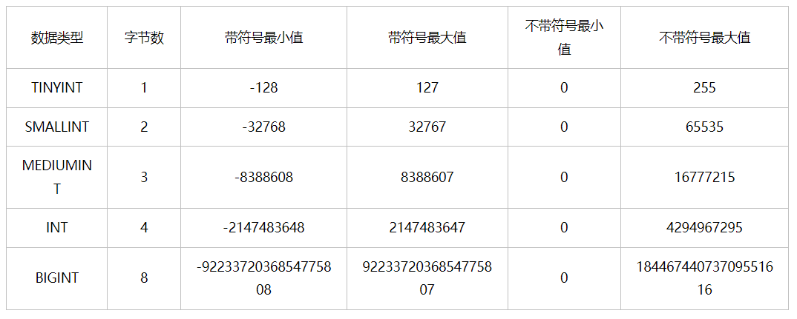
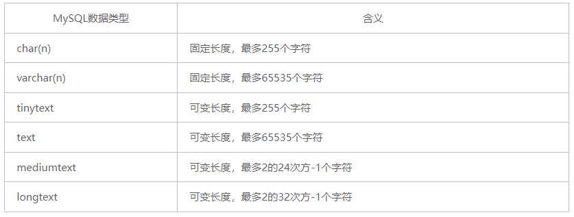
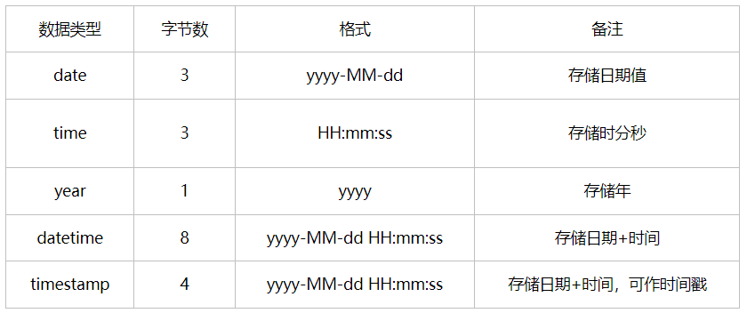

[TOC]


# 基础篇

## 第一章 初识MySQL

### 1.1 数据库分类
1. 关系型数据库：(SQL)
- MySQL, Oracle, Sql Server, DB2, SQLite
- 通过表和表之间，行和列之间的关系进行数据存储
2. 非关系型数据库 (not only SQL)
- Redis, MongDB
- 非关系型数据库，对象存储，通过对象自身的属性来决定
3. DBMS(数据库管理系统)
- 科学有效地管理数据，维护和获取数据。
### 1.2 MySQL
- 是一个关系型数据库管理系统
- 属于Oracle公司
- 开源，体积小，成本低，速度快
- **DBMS -> 多个数据库 -> 多张表**
## 第二章 下载安装
>安装之后：

    net start mysql
    mysql -u root -p123456
    net stop mysql
## 第三章 SQL语法
### 3.1 SQL通用语法
- 可以单行或多行书写，分号结尾
- 不区分大小写，关键字建议大写
- -- 或者 # 或者 /* */ 注释
- 可以使用空格或者缩进增强可读性
### 3.2 SQL分类
1. DDL：数据定义语言，定义数据库、表、字段
2. DML：数据操作语言，增删改
3. DQL：数据查询语言，查
4. DCL：数据控制语言，创建用户，控制权限
### 3.3 DDL
#### 3.3.1 DDL-数据库操作

    # 中括号中内容可选
    
    # 查询所有数据库
    SHOW DATABASES;
    
    # 查询当前数据库
    SELECT DATABASE();
    
    # 创建
    CREATE DATABASE [IF NOT EXISTS] 数据库名 [DEFAULT CHARSET 字符集] [COLLATE 排序规则];
    
    # 删除
    DROP DATABASE [IF EXISTS] 数据库名;
    
    # 使用
    USE 数据库名;
#### 3.3.2 DDL-表操作-查询

    # 查询当前数据库所有表
    SHOW TABLES;
    
    # 查询表结构
    DESC 表名;
    
    # 查询制定表的建表语句
    SHOW CREATE TABLE 表名;
#### 3.3.3 DDL-表操作-创建

    CREATE TABLE 表名(
        字段1 字段1类型[COMMENT 字段1注释],
        字段2 字段2类型[COMMENT 字段2注释],
        ...
        字段n 字段n类型[COMMENT 字段n注释]
    ) [COMMENT 表注释];
#### 3.3.4 DDL-表操作-数据类型
**1. 数字**



        # 年龄最多三位数，且一定是正整数
        age TINYINT UNSIGNED;
    
        # 分数最高100.0，下面的4代表长度，1代表小数点后几位
        score double(4, 1);
**2. 字符串类型**


- **上表的 varchar 是 可变长度，写错了**
- char(n) 固定长度，char(4)不管存入几个字符，都将占用4个字节，性能好
- varchar(n)是存入的实际字符数+1个字节（n<=255）或2个字节(n>255)，所以varchar(4),存入3个字符将占用4个字节，性能差
  

**3. 日期类型**

#### 3.3.5 DDL-表操作-修改

    # 添加字段
    ALTER TABLE 表名 ADD 字段名 类型(长度) [COMMENT 注释] [约束];
    
    # 修改数据类型
    ALTER TABLE 表名 MODIFY 字段名 新数据类型(长度);
    
    # 修改字段名和数据类型
    ALTER TABLE 表名 CHANGE 旧字段名 新字段名 类型(长度) [COMMENT 注释] [约束];
    
    # 删除字段
    ALTER TABLE 表名 DROP 字段名;
    
    # 修改表名
    ALTER TABLE 表名 RENAME TO 新表名;
#### 3.3.6 DDL-表操作-删除

    # 删除表
    DROP TABLE [IF EXISTS] 表名;
    
    # 删除指定表，并重新创建该表，只留下表结构，没有数据了
    TRUNCATE TABLE 表名;
### 3.4 DML
#### 3.4.1 DML-添加数据

    # 给指定字段添加数据
    INSERT INTO 表名(字段1, 字段2, ...) VALUES(值1, 值2, ...);
    
    # 给全部字段添加数据
    INSERT INTO 表名VALUES(值1, 值2, ...);
    
    # 批量添加数据
    INSERT INTO 表名(字段1, 字段2, ...) VALUES(值1, 值2, ...),(值1, 值2, ...)...;
    INSERT INTO 表名VALUES(值1, 值2, ...),(值1, 值2, ...)...;
#### 3.4.2 DML-修改数据
    UPDATE 表名 SET 字段名1=值1, 字段名2=值2, ... [WHERE 条件];
#### 3.4.3 DML-删除数据
    DELETE FROM 表名 [WHERE 条件];
### 3.5 DQL
#### 3.5.1 DQL语法
    SELECT 
        字段列表
    FROM
        表名列表
    WHERE
        条件列表
    GROUP BY
        分组字段列表
    HAVING
        分组后条件列表
    ORDER BY
        排序字段列表
    LIMIT
        分页参数
#### 3.5.2 DQL基本查询
    # 查询多个字段
    SELECT 字段1, 字段2, 字段3... FROM 表名;
    SELECT * FROM 表名; // 慎用
    
    # 设置别名
    SELECT 字段1[[AS] 别名1], 字段2[[AS] 别名2] ... FROM表名;
    
    # 去除重复记录
    SELECT DISTINCT 字段1, 字段2, 字段3... FROM 表名;
#### 3.5.3 DQL条件查询
    # 语法
    SELECT 字段1, 字段2, 字段3... FROM 表名 WHERE 条件列表;
    
    # 条件
    >, <, =, BETWEEN AND, IN(), LIKE 占位符, IS NULL, AND, OR, NOT

**注意：** 
- **BETWEEN AND 两端包含**
- **SELECT * FROM emp WHERE age in(10,19,20);**
- **占位符有：_ %, _数量严格，%表示任意数量字符**

        SELECT * FROM emp WHERE name like '___';  // 查名字是3个字
        SELECT * FROM emp WHERE idCard like '%9'; // 查结尾是9的
#### 3.5.4 DQL聚合函数
- 将一列数据作为整体，进行纵向计算
- 常见：count, max, min, avg, sum


        SELECT count(id) from emp;
        SELECT avg(age) from emp;
        SELECT min(age) from emp;
        SELECT max(age) from emp;

**注意：** 
- null 不参与计算
#### 3.5.5 DQL分组查询
    # 语法
    SELECT 字段列表 FROM 表名 [WHERE 条件] GROUP BY 分组字段名 [HAVING 分组后的过滤条件];
    
    select gender,avg(age) from emp where age < 19 group by gender having avg(age)>10;
**注意：** 
- **where 是分组之前进行过滤，不满足where的条件，不参与分组，HAVING则是分组之后过滤。**
- **where不能对聚合函数进行判断，而having可以。**
- **ONLY_FULL_GROUP_BY 模式下，使用 GROUP BY 子句进行分组查询时，SELECT 列表中的非聚合列必须包含在 GROUP BY 子句中。**
#### 3.5.5 DQL排序查询
    # 语法
    SELECT 字段列表 FROM 表名 ORDER BY 字段1 排序方式1, 字段2 排序方式2;
    
    select * from emp order by age asc, workNum desc;
    
    ASC 升序
    DESC 降序
#### 3.5.6 DQL分页查询
    # 语法
    SELECT 字段列表 FROM 表名 LIMIT 起始索引, 查询记录数;
    
    # 查询第2页员工数据，每页展示10条记录
    select * from emp limit 10,10;

**注意：** 
- **起始索引从0开始，起始索引=(查询页码-1)\*每页显示记录数**
- **分页查询是数据库方言，MySQL用的是LIMIT**
- **如果查询的是第一页数据，起始索引可以省略，直接简写为limit 10**
#### 3.5.6 DQL执行顺序

    FROM
        表名列表
    WHERE
        条件列表
    GROUP BY
        分组字段列表
    HAVING
        分组后条件列表 
    SELECT 
        字段列表
    ORDER BY
        排序字段列表
    LIMIT
        分页参数
### 3.6 DCL
#### 3.6.1 DCL-管理用户
    # 查询用户
    USE mysql;
    SELECT * FROM user;
    
    # 创建用户
    CREATE USER '用户名'@'主机名' IDENTIFIED BY '密码';
    
    # 修改用户密码
    ALTER USER '用户名'@'主机名' IDENTIFIED WITH mysql_native_password BY '新密码';
    
    # 删除用户
    DROP USER '用户名'@'主机名';
**注意：**
- **主机名可以用%表示任意主机**
#### 3.6.2 DCL-权限控制
    # 查询权限
    SHOW GRANTS FOR '用户名'@'主机名';
    
    # 授予权限
    GRANT 权限列表 ON 数据库名.表名 TO '用户名'@'主机名';
    
    # 撤销权限
    REVOKE 权限列表 ON 数据库名.表名 FROM '用户名'@'主机名';

## 第4章 函数
### 4.1 字符串函数
- **CONCAT(S1, S2,...):** 字符串拼接

- **LOWER(str):** 全部小写

- **UPPER(str):** 全部大写

- **LPAD(str, n, pad):** 左填充，用pad对str左侧填充，直到到达n个字符串长度

- **RPAD(str, n, pad):** 右填充，用pad对str右侧填充，直到到达n个字符串长度

- **TRIN(str):** 去掉字符串头尾空格

- **SUBSTRING(str, start, len):** 返回str从start位置开始len长度的子串

    ```SQL
    select lpad("01",5,"23");
    update emp set workNum = lpad(workNum, 5 , '0');
    ```
    
    
### 4.2 数值函数
- **CEIL(x):** 向上取整
- **FLOOR(x):** 向下取整
- **MOD(x, y):** 返回x/y的模
- **RAND():** 返回0~1内的随机数
- **ROUND(x, y):** 求参数x的四舍五入的值，保留y位小数

    ```
    select ceil(1.1);
    select lpad(round(rand()*1000000,0), 6, 0); // 六位随机数
    ```
    
    
### 4.3 日期函数
- **CURDATE():** 当前日期

- **CURTIME():** 当前时间

- **NOW():** 当前日期+时间

- **YEAR(date):** date的年 

- **MONTH(date):** 

- **DAY(date):** 

- **DATE_ADD(date, INTERVAL expr type):** 日期/时间 + 时间间隔 expr

- **DATEDIFF(date1, date2):** 时间间隔

    ```
    select date_add(now(), interval 510 day);   // 2025-03-31 09:30:30
    select datediff('2025-03-31', curdate());   // 510
    select name, datediff(curdate(),entryDate) as 'entrydates' from emp order by 'entrydates' desc;
    ```

    
### 4.4 流程控制函数
- **IF(value, t, f):** value 是 true，返回 t，否则返回 f
- **IFNULL(value1, value2):** 如果 value1 不为 null，返回 value1，否则value2
- **CASE WHEN [val1] THEN [res1]...ELSE[default] END:** 如果val1为true，返回res1，...否则返回默认值
- **CASE [wxpr] WHEN [val1] THEN [res1]...ELSE[default] END:** 如果expr是val1则返回res1，...否则返回默认值

    ```
    SELECT name, CASE WHEN age < 18 THEN '小年轻' WHEN age = 18 THEN '正好' ELSE '老东西' END FROM emp;
    ```

## 第5章 约束

### 5.1 约束概述

>概念：约束是作用于表中字段上的规则，用于限制存储在表中的数据
>
>目的：保证数据库中数据的正确性、有效性和完整性

| 约束                 | 描述                                                     | 关键字      |
| -------------------- | -------------------------------------------------------- | :---------- |
| 非空约束             | 限制该字段的数据不能为null                               | NOT NULL    |
| 唯一约束             | 保证该字段的所有数据都是唯一、不重复的                   | UNIQUE      |
| 主键约束             | 主键是一行数据的唯一标识，要求非空且唯一                 | PRIMARY KEY |
| 默认约束             | 保存数据时，如果未指定该字段的值，则采用默认值           | DEFAULT     |
| 检查约束（8.0.16后） | 保证字段值满足某一个条件                                 | CHECK       |
| 外键约束             | 用来让两张表的数据之间建立连接，保证数据的一致性和完整性 | FOREIGN KEY |

```sql
CREATE TABLE user (
    id int primary key auto_increment comment '主键',
    name varchar(10) not null unique comment '姓名',
    age int comment '年龄',
    status char(1) default '1' comment '状态',
    gender char(1) comment '性别'
) comment '用户表';

ALTER TABLE `user` CONVERT TO CHARACTER SET utf8;
```

### 5.2 外键约束

> 外键：用来让两张表的数据之间建立连接，保证数据的一致性和完整性。
>
> 子表：有外键的那张表
>
> 父表：子表关联的那张表

```
# 添加外键
ALTER TABLE 表名 ADD CONSTRAINT 外键名称 FOREIGN KEY(外键字段名) REFERENCES 主表(主表列名);

# 删除外键
ALTER TABLE 表名 FROP FOREIGN KEY 外键名称;
```

| 行为        | 说明                                                         |
| ----------- | ------------------------------------------------------------ |
| NO ACTION   | 当在父表中删除/更新对应记录时，首先检查该记录是否有对应外键，如果有则不允许删除/更新。（类RESTRICT） |
| RISTRICT    | 当在父表中删除/更新对应记录时，首先检查该记录是否有对应外键，如果有则不允许删除/更新。（类NO ACTION） |
| CASCADE     | 当在父表中删除/更新对应记录时，首先检查该记录是否有对应外键，如果有则也删除/更新子表中的**整条记录**。 |
| SET NULL    | 当在父表中删除对应记录时，首先检查该记录是否有对应外键，如果有则设置子表中该外键的值为null。 |
| SET DEFAULT | 父表有变更时，子表将外键列设置成一个默认的值。（Innodb不支持） |

```
ALTER TABLE 表名 ADD CONSTRAINT 外键名称 FOREIGN KEY(外键字段名) REFERENCES 主表(主表列名) ON UPDATE CASCADE ON DELETE CASCADE;
```

## 第6章 多表查询

### 6.1 多表关系

#### 6.1.1 一对多

- 案例：部门-员工
- 实现：在多的一方建立外键

#### 6.1.2 多对多

- 案例：学生-课程
- 实现：建立第三张中间表，中间表至少包含两个外键，分别关联两方主键

#### 6.1.3 一对一

- 案例：用户-用户详情
- 关系：多用于多表拆分
- 实现：在任意一方加入外键，关联另一方的主键，并设置外键为unique

### 6.2 多表查询概述

#### 6.2.1 概述

- 概述：指从多张表中查询数据
- 笛卡尔积：两个集合A B的所有组合情况。多表查询要消除。

```
select * from t1, t2;	# 产生笛卡尔积
select * from t1, t2 where t1.t2_id = t2.id;  	#消除笛卡尔积
```

#### 6.2.2 分类

1. **连接查询**

   - 内连接：查AB交集
   - 外连接：
     - 左外连接：查询左表所有数据和交集
     - 右外连接：查询右表所有数据和交集

   - 自连接：当前表与自身的连接查询，自连接必须使用别名

2. **子查询**

### 6.3 内连接

```
# 隐式内连接
SELECT 字段列表 FROM 表1, 表2 WHERE 条件;

# 显式内连接
SELECT 字段列表 FROM 表1 [INNER] JOIN 表2 ON 连接条件;
```

```
# 隐式
select * from emp, dept where emp.dept_id = dept.id;
select * from emp e, dept d where e.dept_id = d.id;

# 显式
select e.name, d.name from emp e inner join dept d on e.dept_id = d.id;
```

### 6.4 外连接

```
# 左外连接
SELECT 字段列表 FROM 表1 LEFT [OUTER] JOIN 表2 ON 条件;
select * from emp e left join test.dept d on d.id = e.dept_id;

# 右外连接
SELECT 字段列表 FROM 表1 RIGHT [OUTER] JOIN 表2 ON 条件;
select * from emp e right join test.dept d on d.id = e.dept_id;
```

###  6.5 自连接

> 在自连接时，虽然只有一张表，但是把它看作两张表

```
# 自连接
SELECT 字段列表 FROM 表1 别名1 JOIN 表1 别名2 ON 条件;
```

```
# 查询员工以及其所属领导的名字
# 内连接实现，如果无领导，则不显示
select e1.name, e2.name from emp e1 join emp e2 on e1.managerID = e2.id;

# 左外连接实现，就算无领导，也显示
select e1.name, e2.name from emp e1 left join emp e2 on e1.managerID = e2.id;
```

### 6.6 联合查询-union， union all

- union查询：把多次查询的结果合并起来并去重，形成一个新的查询结果集
- union all查询：合并但是不去重

```
# 语法
SELECT 字段列表 FROM 表1 WHERE 条件1 ...
UNION [ALL]
SELECT 字段列表 FROM 表2 WHERE 条件2 ...;

# 举例
select emp.name from emp where salary < 4000
union
select emp.name from emp where age > 30;
```

**注意：**

- **多张表的列数和字段类型必须一致**

### 6.7 子查询

#### 6.7.1 子查询概述

- 概念：SQL语句中嵌套SELECT语句，成为嵌套查询，也叫子查询

- 范围：子查询的外部语句可以是 INSERT / UPDATE / DELETE / SELECT 中的任何一个

  ```
  # 语法
  SELECT * FROM t1 WHERE column1 = (SELECT column1 FROM t2)
  ```

  

- 分类1：
  - 标量子查询：结果为单个值
  - 列子查询：结果为一列
  - 行子查询：结果为一行
  - 表子查询：结果为多行多列

- 分类2：
  - WHERE 之后出现的子查询
  - FROM 之后出现的子查询
  - SELECT 之后出现的子查询

#### 6.7.2 标量子查询

```
# 查询销售部员工信息
# 一步一步查询
select id from dept where name = '销售部';
select * from emp where dept_id = 4;

# 使用子查询
select * from emp where dept_id = (select id from dept where name = '销售部');

# 其他应用
select * from emp where entryDate > (select entryDate from emp where name = '杨过');
```

#### 6.7.3 列子查询

> 常用操作符：IN, NOT IN, ANY, SOME, ALL

| 操作符 | 描述                                        |
| ------ | ------------------------------------------- |
| IN     | 在指定的集合范围内，多选一                  |
| NOT IN | 不在指定的集合范围之内                      |
| ANY    | 子查询返回列表中，有任意一个满足即可        |
| SOME   | 与 ANY 等同，使用 SOME 的地方都可以使用 ANY |
| ALL    | 子查询返回列表的所有值都必须满足            |

```
# 查询销售部和市场部的所有人信息
# 一步一步查询
select id from dept where name = '销售部' or name = '市场部';	// 2,4
select * from emp where dept_id in (2,4);

# 使用子查询
select * from emp where dept_id in (select id from dept where name = '销售部' or name = '市场部');

# 返回比财务部所有人工资都高的员工信息
select * from emp where salary > all (select salary from emp where dept_id = (select id from dept where name = '财务部'));
```

#### 6.7.4 行子查询

```
# 查询和段誉的薪资一样，领导也一样的所有人的信息
# 一步一步查询
select salary, managerID from emp where name = '段誉';
select * from emp where (salary, managerID) = (4000, 5);

# 使用子查询
select * from emp where (salary, managerID) = (select salary, managerID from emp where name = '段誉');
```

#### 6.7.5 表子查询

> 常用操作符：IN

```
# 查询与乔峰，小龙女职位薪资都相同的员工信息
select * from emp where (job, salary) in (select job, salary from emp where name = '乔峰' or name = '小龙女');

# 查询在2023-01-05之后入职的员工信息和他们的部门信息
select e.*, d.name from (select * from emp where entryDate > '2023-01-05
2023-01-05') e left join dept d on e.dept_id = d.id;
```

#### 6.7.6 案例

```
# 1. 查询员工的姓名、年龄、职位和部门信息
select e.name, e.age, e.job, d.name from emp e,dept d where e.dept_id = d.id;

# 2. 查询年龄小于30岁的员工的姓名、年龄、职位和部门信息
select e.name, e.age, e.job, d.name from emp e inner join test.dept d on e.dept_id = d.id where e.age < 30;

# 3. 查询拥有员工的部门id, name
select dept.id, dept.name from dept where dept.id in (select dept_id from emp);	// 子查询
select distinct d.id, d.name from emp e, dept d where e.dept_id = d.id;			// 隐式内连接

# 4. 查询年龄大于30的员工信息及部门名称，没部门也显示
select e.*, d.name from emp e left join test.dept d on d.id = e.dept_id where e.age > 30;

# 5. 查询员工薪资等级
select e.name, s.grade from emp e, salayGrade s where e.salary > s.low and e.salary < s.high;

# 6. 查询研发部所有员工信息和工资等级
# 指令1没有用distinct而指令2用了distinct，因为指令2缺少e.dept_id = d.id，实际上没有把dept表关联起来，产生了笛卡尔积
# 连接n张表，至少要用n - 1个条件
# 指令1
select e.name, s.grade from emp e, salayGrade s,dept d where e.salary > s.low and e.salary < s.high and e.dept_id = d.id and d.name = '研发部';
# 指令2
select distinct  e.name, s.grade from emp e, salayGrade s,dept d where e.salary > s.low and e.salary < s.high and e.dept_id = (select id from dept where name = '研发部');

# 7. 查询研发部的平均工资
select avg(e.salary) from emp e, dept d where e.dept_id = d.id and d.name = '研发部';

# 8. 查询工资比小龙女高的员工信息
select * from emp where emp.salary > (select salary from emp where emp.name = '小龙女');

# 9. 查询比平均工资高的员工信息
select * from emp e where salary > (select avg(salary) from emp);

# 10. 查询低于本部门平均工资的员工信息
# 法1：列出一张部门薪资平均表
select *
from emp e,
     (select e.dept_id, avg(salary) c
      from emp e,
           dept d
      where e.dept_id is not null
      group by e.dept_id) t
where e.dept_id = t.dept_id
  and e.salary < t.c;
  
# 法2：每次查询该部门平均薪资
select *
from emp e1
where e1.salary < (select avg(e2.salary) from emp e2 where e2.dept_id = e1.dept_id);

# 11. 查询所有的部门信息，并统计部门的员工人数
# 法1：建立新表
select d.id, d.name, t.c
from dept d,
     (select count(*) c, emp.dept_id from emp where emp.dept_id is not null group by emp.dept_id) t
where d.id = t.dept_id;

# 法2：直接查询
select d.id, d.name, (select count(*) from emp where emp.dept_id = d.id)
from dept d;

# 12. 查询所有学生的选课情况，展示学生姓名、学号、课程名称
# 三张表：student, course, student_course
select s.name, s.number, c,name 
from student s,
	course c, 
	student_course sc 
where s.id = sc.studentID 
	and c.id = sc.courseID;
```

## 第7章 事务

### 7.1 简介

> 概念：事务是一组操作的集合，是一个不可分割的单位，事务会把所有的操作作为一个整体一起向系统提交或撤销操作请求，即这些操作**要么同时成功，要么同时失败**。

> 案例：银行转账

### 7.2 操作

> 演示：

```
# 1. 创建表格，插入数据
create table account (
    id int auto_increment primary key comment "主键id",
    name varchar(10) comment "姓名",
    money int comment "余额"
) comment "账户表";

ALTER TABLE `account` CONVERT TO CHARACTER SET utf8;

insert into account(id, name, money) values (null,"张三",2000), (null,"李四",2000);

# 2. 转账操作
## 1.1 查询张三余额
select * from account where name = "张三";

## 1.2 张三余额-1000
update account set money = money - 1000 where name = "张三";

程序异常... # 这条程序语法检测出问题，上面的执行，下面的不执行

## 1.3 李四余额+1000
update account set money = money + 1000 where name = "李四";

# 3. 恢复操作
update account set money = 2000 where name = "李四" or name = "张三";
```

> 事务操作：

**方式1：**

```
# 查看/设置事务提交方式
SELECT @@autocommit;
SET @@autocommit = 0;

# 提交事务
COMMIT;

# 回滚事务
ROLLBACK;
```

```
# 查看事务提交方式
SELECT @@autocommit;	# 1

# 设置事务提交方式
SET @@autocommit = 0;

# 查看事务提交方式
SELECT @@autocommit;	# 0

#-------------------------------------正常----------------------------------------------

# 2. 转账操作
## 1.1 查询张三余额
select * from account where name = "张三";

## 1.2 张三余额-1000
update account set money = money - 1000 where name = "张三";

## 1.3 李四余额+1000
update account set money = money + 1000 where name = "李四";		# 表中数据不变

# 提交事务
COMMIT;		# 表中数据改变

#-------------------------------------异常----------------------------------------------

# 2. 转账操作
## 1.1 查询张三余额
select * from account where name = "张三";

## 1.2 张三余额-1000
update account set money = money - 1000 where name = "张三";

........sdas.d.a.s.asd.as.da.s.da.s.d.as.d.as.d.as.d.a.sd.a.s.da.s 	# 出错

## 1.3 李四余额+1000
update account set money = money + 1000 where name = "李四";		# 表中数据不变

# 回滚事务
ROLLBACK;	# 表中数据不变
```

**方式2：**

```
# 开启事务
START TRANSACTION 或 BEGIN;

# 提交事务
COMMIT;

# 回滚事务
ROLLBACK;
```

```
# 开启事务
START TRANSACTION;

# 2. 转账操作
## 1.1 查询张三余额
select * from account where name = "张三";

## 1.2 张三余额-1000
update account set money = money - 1000 where name = "张三";

update ........	# 出错

## 1.3 李四余额+1000
update account set money = money + 1000 where name = "李四";

commit;		# 无报错，提交，结束事务

ROLLBACK;	# 有报错，回滚，结束事务
```

### 7.3 事务四大特性

1. 原子性：是一个不可分割的单位，操作要么同时成功，要么同时失败
2. 一致性：事务完成时，必须使所有数据都保持一致状态
3. 隔离性：数据库系统提供的隔离机制，保证事务在不受外部并发操作影响的独立环境下运行
4. 持久性：事务一旦提交或回滚，它对数据库中的数据的改变就是永久的

### 7.4 并发事务问题

| 问题       | 描述                                                         |
| ---------- | ------------------------------------------------------------ |
| 脏读       | 一个事物读到另一个事务还没有提交的数据                       |
| 不可重复读 | 一个事务先后读取同一条记录，但两次读取的数据不同，称之为不可重复读 |
| 幻读       | 一个事务按照条件查询数据时，没有对应的数据行，但是在插入数据时，又发现这行已经存在，如同“幻影” |

### 7.5 事务的隔离级别

| 隔离级别                | 脏读 | 不可重复读 | 幻读 |
| ----------------------- | ---- | ---------- | ---- |
| Read uncommited         | √    | √          | √    |
| Read commited           | ×    | √          | √    |
| Repeatable Read（默认） | ×    | ×          | √    |
| Serializable            | ×    | ×          | ×    |

**注意：**

- 隔离级别越来越高，性能越来越差

```
# 查看事务隔离级别
SELECT @@TRANSACTION_ISOLATION

# 设置事务隔离级别
SET [SESSION|GLOBAL] TRANSACTION ISOLATION LEVEL {Read uncommited | Read commited | Repeatable Read | Serializable}
```

# 进阶篇

## 第1章 存储引擎

### 1.1 MySQL 体系结构


- 连接层
- 服务层
- **引擎层**
- 存储层

### 1.2 存储引擎简介

> 存储引擎就是存储数据、建立索引、更新 / 查询数据等技术的实现方式。存储引擎是基于表的，而不是基于库的，所以存储引擎也可被称为表类型。

```
# 创建表时，指定存储引擎
CREATE TABLE 表名(
	字段1 类型1,
	...
)ENGINE={INNODB|MEMORY|MYISAM...};
```

### 1.3 存储引擎特点

#### 1.3.1 InnoDB

- 介绍：
  - 兼顾高可靠性和高性能，5.5后默认
- 特点：
  - DML遵循ACID模型（即事务四大特性），支持**事务**
  - **行级锁**，提高并发访问特性
  - 支持**外键**约束

- 文件：
  - **文件 xxx.ibd:** xxx是表名，InnoDB引擎的每张表都会对应这样一个表空间文件，存储该表的表结构(frm, sdi)，数据和索引。
  - **参数：**innodb_file_per_table

- 逻辑存储结构：
  - 表空间 - 段 - 区 - 页 - 行

#### 1.3.2 MyISAM

- 介绍：
  - MySQL早期默认的存储引擎
- 特点：
  - 不支持事务和外键
  - 支持表锁，不支持行锁
  - 访问速度快
- 文件：
  - xxx.sdi: 存储表结构信息
  - xxx.MYD: 存储数据
  - xxx.MYI: 存储索引

#### 1.3.3 Memory

- 介绍：
  - 存储在内存中，收到硬件或断电影响，只能作为临时表或缓存使用
- 特点：
  - 内存存放
  - hash索引（速度快）
  - 表大小有限制
- 文件：
  - xxx.sdi: 存储表结构信息

### 1.4 存储引擎选择

- InooDB：对事务完整性要求高，并发一致性，数据除了插入、查询，还有很多更新、删除时
- MyISAM: 插入、查询为主，对事务完整性、并发性要求不高时
- Memory: 临时表、缓存

## 第2章 索引

### 2.1 索引概述

- 概念：索引是帮助MySQL高效获取数据的有序数据结构。
- 优点：
  - 提高检索效率，降低数据库IO成本
  - 通过索引列对数据排序，降低数据排序成本，降低CPU消耗
- 缺点：
  - 索引列占空间
  - 降低了更新表的速度，INSERT, UPDATE, DELETE 的效率变低

### 2.2 索引结构

#### 2.2.1 不同的索引

- MySQL的索引是在存储引擎层实现的，存储引擎不同则索引结构不同。

| 索引结构             | 描述                                                         |
| -------------------- | ------------------------------------------------------------ |
| **B+Tree 索引**      | 最常见                                                       |
| Hash 索引            | 底层用Hash, 只有精确匹配索引列的查询才有效，不支持范围查询   |
| R-Tree (空间索引)    | 空间索引是MyISAM引擎的一个特殊索引类型，主要用于地理空间数据类型 |
| Full-text (全文索引) | 通过建立倒排索引，快速匹配文档的方式，类似于Lucense, Solr, ES |

#### 2.2.2 B Tree（多路平衡查找树）

> 二叉树缺点：顺序存储形成链表，检索变慢
>
> 红黑树缺点：大数据量情况下，层级较深，检索变慢
>
> 引出B-Tree：下面是一棵五阶B树，最大度数（子节点数）为5，最大Key的数目是4


#### 2.2.3 B+Tree 索引

> B+树：所有元素都在叶子节点，且在叶子节点有序
>
> MySQL索引数据结构对经典的B+树进行了优化，增加了一个指向相邻叶子结点的链表指针，形成了有顺序指针的B+树

- **经典B+Tree：**


- **MySQL索引数据结构：**


#### 2.2.4 Hash 索引

> 采用一定的Hash算法，将键值换算成新的Hash值，映射到对应的槽位上，然后存储在Hash表中
>
> 如果两个键值映射到同一个槽位上，产生了Hash冲突，可以通过链表解决

- 特点：
  - 只能用于对等比较（=, in），不支持范围查询（between, >, <）
  - 无法利用索引完成排序操作
  - 查询效率高，通常只需要一次检索就可以了

- 支持：、
  - 只有Memory支持
  - InnoDB拥有自适应hash功能

### 2.3 索引分类

- **整体分类：**

| 分类     | 含义                                   | 特点                     | 关键字   |
| -------- | -------------------------------------- | ------------------------ | -------- |
| 主键索引 | 针对于表中主键创建的索引               | 默认自动创建，只能有一个 | PRIMARY  |
| 唯一索引 | 避免同一个表中某数据列中的值重复       | 可以有多个               | UNIQUE   |
| 常规索引 | 快速定位特定数据                       | 可以有多个               |          |
| 全文索引 | 查找的是文本中的关键词，而非索引中的值 | 可以有多个               | FULLTEXT |

- **InnoDB 中的分类：**

| 分类                        | 含义                                                 | 特点           |
| --------------------------- | ---------------------------------------------------- | -------------- |
| 聚集索引（Clustered Index） | 存储与索引在一起，索引结构的叶子节点保存了数据       | 必须有，仅一个 |
| 二级索引（Secondary Index） | 存储与索引分开，索引结构的叶子节点关联的是对应的主键 | 可以有多个     |

- **聚集索引的选取规则：**

  - 存在主键，则主键索引就是聚集索引

  - 不存在主键，则第一个唯一索引作为聚集索引

  - 无主键，无唯一索引，则自动生成一个rowid作为隐藏的聚集索引

- **实例演示：**

  > 先在name对应的二级索引中查询‘Arm’，找到了主键10，再在聚集索引中查询10，得到全部信息。

  

### 2.4 索引语法

```
# 创建索引
CREATE [UNIQUE|FULLTEXT] INDEX index_name ON table_name(index_col_name, ...);

# 查看索引
SHOW INDEX FROM table_name;

# 删除索引
DROP INDEX index_name ON table_name;
```

### 2.5 SQL 性能分析

- SQL 执行频率

  ```
  # 查询不同功能的使用频率
  SHOW GLOBAL STATUS LIKE 'Com_';
  ```

- 慢查询日志

  > 记录了所有执行时间超过指定参数（long_query_time, 单位：秒，默认10秒）的所有SQL语句的日志
  >
  > MySQL的慢查询日志默认没有开启，需要在配置文件（/etc/my.cnf）中配置

  ```
  # 产看慢查询日志是否开启
  SHOW VARIABLES LIKE 'slow_query_log';
  
  # 开启慢查询日志（在配置文件中修改）
  slow_query_log=1
  # 设置慢日志的时间为2s，SQL语句执行时间超过2s，则视为慢查询
  long_query_time=2
  ```

- profile 详情

  > 能在做SQL优化时帮助我们了解时间都耗费到哪里去了

  ```
  # 查看是否支持
  SELECT @@HAVE_PROFILING;
  
  # 开关
  SET profiling=1;
  
  # 产看每一条SQL的耗时基本情况
  SHOW PROFILE;
  
  # 查看指定 query_id 的SQL语句CPU使用情况
  SHOW PROFILE [CPU] FOR QUERY query_id;
  ```

- explain 执行计划

  > EXPLAIN, DESC 命令获取MySQL如何执行SELECT语句的信息，包括在执行中表如何连接和连接的顺序

  ```
  # 语法
  EXPLAIN SELECT ...;
  ```

  - **Id:** select查询的序列号，执行子句或操作表的顺序。id相同，从上到下；id不同，先大后小。
  - select_type: 类型
  - **type:** 连接类型，性能由好到差是 NULL, system, const, eq_ref, ref, range, index, all
  - possible_key: 显示可能用到的索引
  - key: 实际使用的索引
  - key_len: 索引使用的字节数
  - rows: 执行查询的行数的预估值
  - filtered: 返回结果的行数占需读取行数的百分比，越大越好
  - extra: 额外信息

### 2.6 索引使用

#### 2.6.1 验证索引效率

> 最开始只有主键索引，用 id 查询会很快，但用 name 等其他字段查询会很慢，这时就需要创建name的索引。

#### 2.6.2 索引使用原则

1. 最左前缀法则

   > 如果索引了多列（联合索引），要遵守最左前缀法则：查询从索引的最左列开始，并且不跳过索引中的列。如果跳过某一列，索引将部分失效（后面的字段索引失效）。

   > 举例：某联合索引 name，age，career，只查age， career，不走索引，查name，career，只有name有效。

2. 范围查询

   > 联合索引中，出现范围查询时（<, >），范围查询右侧的列索引失效。

   > 解决方法：用>=, <=

#### 2.6.3 索引失效

1. 索引列运算

   > 不要在索引列上进行运算操作，索引列会失效。

   > 举例：select * from user where substring(phone, 10, 2) = '15';

2. 字符串不加引号

   > 字符串类型字段使用时，不加引号，索引失效。

   > 举例：select * from user where phone = 1515646465;

3. 头部模糊查询

   > 头部模糊匹配，索引失效。（尾部不会）
   >
   > 举例：
   >
   > 不失效：select * from user where profession like '软件%';
   >
   > 会失效：select * from user where profession like '%工程';

4. or连接的条件

   > 用or分开的条件，如果or前的条件中的列有索引，后面没有，那么涉及的索引都失效。

5. 数据分布影响

   > 如果MySQL评估，使用索引比全表更慢，则索引失效。

#### 2.6.4 SQL 提示

> 在SQL语句中加入一些人为的提示来达到优化操作的目的。

```
# use index （建议MySQL使用该索引）
explain select * from user use index(idx_user_pro) where profession = '软件工程';

# ignore index （MySQL不使用该索引）
explain select * from user ignore index(idx_user_pro) where profession = '软件工程';

# force index （强制MySQL使用该索引）
explain select * from force ignore index(idx_user_pro) where profession = '软件工程';
```

#### 2.6.5 覆盖索引

> 尽量使用覆盖索引（查询使用了索引，并且需要返回的列在该索引中全部能找到），减少select *.
>
> 覆盖与否，导致explain的extra中不一样，实际上就是是否需要回表查询。

#### 2.6.6 前缀索引

> 当字段类型是字符串时，有时需要索引很长的字符串，这会让索引变得很大，查询时浪费磁盘IO，影响效率。此时可以只将字符串的一部分前缀建立索引，节省空间，提高效率。
>
> 前缀长度：选择性是指不重复的索引值和数据表的记录总数的比值，选择性越高，效率越高，如唯一索引的选择性是1
>
> 注意：当然地，前缀索引的叶子节点中可能出现索引相同，id不同的情况

```
# 语法
create index idx_xxx on table_name(column(n));
```

#### 2.6.7 单列索引和联合索引

> 存在多个查询条件，建议建立联合索引，减少回表查询。

### 2.7 索引设计原则

1. 针对数据量较大（M），且查询较为频繁。

2. 针对常作为查询条件，排序，分组操作的字段建立索引。
3. 选择区分度较高的列作为索引。
4. 字段长度较长，建立前缀索引。
5. 尽量联合索引，形成覆盖查询，较少回表查询。
6. 控制索引的数量，越多代价越大，影响增删改查的效率。
7. 如果索引列不能存储NULL值，建表时用NOT NULL约束该列，当优化器知道每列是否包含NULL值时，能更好地确定使用哪个索引。

## 第3章 SQL 优化

### 3.1 插入数据

1. 批量插入

2. 手动提交事务

3. 主键顺序插入

4. 大批量插入数据时，insert效率低，可以使用load命令

   ```
   # 连接时加上参数
   mysql --local-infile -u root -p
   
   # 设置全局参数local_infile=1
   set global local_infile=1;
   
   # 执行load指令将准备好的数据，加载到表结构中
   load data local infile '/root/sql,log' into table user fields terminated by ',' lines terminated by '\n';
   ```

### 3.2 主键优化

#### 3.2.1 数据组织方式

> 在InnoDB存储引擎中，数据根据主键顺序存放，这种存储方式称为索引组织表（index organized tabel, IOT）


- 每个节点都在页里
- 表空间 - 段 - 区 - 页 - 行
- 页分裂：页可以为空，也可以填充一半，也可以填充满。每个页包含2~N行数据（可能行溢出），根据主键排序。假如不按顺序插入，可能将某页从中分开放入新页，新插入数据页放入该新页，同时修改页的链接顺序。
- 页合并：删除时，不是真的删掉，而是标记flagged状态。当页中删除的记录达到merge_threshold阈值（默认50%），查找前后两页，看是否可以合并

#### 3.2.2 主键优化

1. 满足业务需求情况下，尽量降低主键的长度
2. 尽量顺序插入，选择使用AUTO_INCREMENT自增
3. 尽量不要使用UUID或其他自然主键，如身份证（长且无序)
4. 避免修改主键

### 3.3 order by 优化

#### 3.3.1 order by 分类

1. Using filesort：不是通过索引直接返回排序结果的排序都叫Filesort排序
2. Using index：通过有序索引顺序扫描直接返回有序数据，不需要额外排序，效率高

#### 3.3.2 order by 优化

1. 根据排序字段建立合适的索引，所字段排序时，也遵循最左前缀法则
2. 尽量使用覆盖索引
3. 多字段排序，一个升序一个降序，需要注意联合索引在创建时的规则
4. 如果不可避免地出现filesort，大数据排序时，可以适当增大排序缓冲区大小

### 3.4 group by 优化

1. 索引提高效率
2. 分组操作时，索引的使用也满足最左前缀法则

### 3.5 limit 优化

> 大数据的情况下，页码越往后，查询越慢

```
# 覆盖索引+子查询
explain select * from tb t, (select id from tb order by id limit 200000,10) a where t.id = a.id;
```

### 3.6 count 优化

> 没啥好的优化方法

1. count(主键)：遍历整张表，取值，直接累加
2. count(字段)：看是否有not null约束，有和主键一样，没有需要判断
3. count(1)：遍历整张表，但不取值，只放1进去，累加
4. count(*)：不取值，直接累加
5. 效率：count(字段)< count(主键)< count(1)≈count(*)，**所以尽量用 count(\*)**

### 3.7 update 优化

> InooD的行锁是针对索引加的锁，不是针对记录加的锁，并且该索引不能失效，否则会从行锁升级为表锁。

```
# 当 name 无索引时
begin;
update course set name = 'spring' where name = 'springboot';	# 表锁，拿到表锁时，其他事务不能更新
commit;

begin;
update course set name = 'spring' where id = 2;					# 行锁
commit;
```

## 第4章 视图

### 4.1 介绍

> 视图（view）是一种虚拟存在的表。视图中的数据不在数据库中实际存在，行和列数据来自定义视图的查询中使用的表（基表），并且是在使用视图时动态生成的。通俗地说，视图只保存了查询的SQL逻辑，不保存结果。

```
# 创建
CREATE [OR REPLACE] VIEW 视图名称[(列名列表)] AS SELECT ... [WITH[CASCADED|LOCAL] CHECK OPTION];

# 查询
SHOW CREATE VIEW 视图名称;
SELECT * FROM 视图名称...;

# 修改
CREATE [OR REPLACE] VIEW 视图名称[(列名列表)] AS SELECT ... [WITH[CASCADED|LOCAL] CHECK OPTION];
ALTER VIEW 视图名称[(列名列表)] AS SELECT ... [WITH[CASCADED|LOCAL] CHECK OPTION];

# 删除
DROP VIEW [IF EXITS] 视图名称[,视图名称...];
```

### 4.2 检查选项

>使用with check option子句创建视图时，MySQL会通过视图检查正在更改的每个行，插入更新删除，以使其符合视图的定义。MySQL允许基于另一个视图创建视图，它还会检查依赖视图中的规则以保持一致性，为了检查确定的范围，提供了两个选项：cascaded, local，默认前者。
>
>v1,v2,v3，关系：v2继承自v1，v3继承自v2，v1无规则，v2有cascaded或local的规则
>
>cascaded表示除了校验自己的条件，无论v1是否有检查选项，还校验v1的条件；local除了校验自己的条件，当v1有检查选项时，才校验v1的条件。注意递归。

```
# 问题产生
create or place view stu_v_1 as select id,name from student where id<20;
insert into stu_v_1 values(6,'Tom');	# 成功，插入基表中
insert into stu_v_1 values(30,'Tom');	# 成功，插入基表中，尽管id > 20

# 解决
create or place view stu_v_1 as select id,name from student where id<20 with local check option;
insert into stu_v_1 values(6,'Tom');	# 成功，插入基表中
insert into stu_v_1 values(30,'Tom');	# 失败，id > 20
```

### 4.3 更新及作用

1. 更新：只有视图中的字段唯一对应基表中的字段时，才能更新，聚合函数啥的都不行。
2. 作用：
   1. 简化理解，简化操作，经常使用的查询可定义为视图，以后不用每次指定条件
   2. 安全，视图让用户只能看到和修改他们可见的数据
   3. 数据独立，屏蔽基表变化对业务的影响。比如基表name改名为stu_name，视图把stu_name起别名name即可

## 第5章 存储过程

### 5.1 介绍

> 存储过程：是事先经过编译并存储在数据库中的一段SQL语句的集合，调用存储过程可以简化应用开发人员的很多工作，减少数据在数据库和应用服务器之间的传输，对于提高数据处理的效率是有好处的。其实是数据库SQL语言层面的代码封装和重用。

- 特点：
  - 封装，复用
  - 可以接收参数，也可以返回数据
  - 减少网络交互，效率提升

### 5.2 语法

```
# 创建
CREATE PRECEDURE 存储过程名称[(参数列表)]
BEGIN
	--SQL语句
END;

# 调用
CALL 存储过程名称[(参数列表)];

# 查看
SELECT * FROM INFORMATION_SCHEMA.routines where routine_schema = 数据库名;
SHOW CREATE PROCEDURE 存储过程名称;

# 删除
DROP PROCEDURE [IF EXISTS] 存储过程名称;
```

**注意：**

- 命令行使用存储过程时，由于默认以分号结尾，而创建语句的SQL语句部分就以分号借我，所以创建会不成功，需要重设结束符号。

### 5.3 变量

#### 5.3.1 系统变量

- 全局变量：GLOBAL
- 会话变量：SESSION，只在当前控制台有效

```
# 查看，默认session
SHOW [GLOBAL|SESSION] 系统变量名 =  VARIABLES;
SHOW [GLOBAL|SESSION] 系统变量名 VARIABLES LIKE 'XXX';
SELECT @@[GLOBAL|SESSION].系统变量名;

# 设置
SET [GLOBAL|SESSION] 系统变量名 = 值;
SET @@[GLOBAL|SESSION].系统变量名 = 值;
```

**注意：**

- MySQL服务重启后，设置的全局变量和会话变量都会回到默认值。

#### 5.3.2 用户定义变量

> 不用提前声明，再用的时候直接用“@变量名”使用就可以，其作用域为当前连接。

```
# 赋值，推荐:=，因为=与==相同都是全等判断
SET @var_name = expr [,@var_name = expr...];
SET @var_name := expr [,@var_name = expr...];

SELECT @var_name := expr [,@var_name = expr...];
SELECT 字段名 INTO @var_name FROM 表名;

# 使用
SELECT @var_name;
```

```
# 举例
set @myname = '乔峰';
set @myage :='25';
set @mygender := '男', @myjob := '武林盟主';

select count(*) into @num from emp;
```

#### 5.3.3 局部变量

> 局部变量：是根据需要定义在局部生效的变量，访问之前，需要DECLARE声明。可用作存储过程内的局部变量和输入参数，局部变量的范围是在其内声明的BEGIN...END块。

```
# 声明，变量类型就是熟悉的数据库字段类型
DECLARE 变量名 变量类型[DEFAULT ...];

# 赋值
SET 变量名=值;
SET 变量名:=值;
SELECT 字段名 INTO 变量名 FROM 表名;
```

```
# 举例
create procedure p2()
begin
    declare cnt int default 0;
    select count(*) into cnt from emp;
    select cnt;
end;

call p2();
```

### 5.4 IF 语法

```
# 语法
IF 条件1 THEN
	...
ELSE 条件2 THEN
	...
ELSE
	...
END IF;
```

```
# 举例
CREATE procedure p3()
begin
    declare score int default 58;
    declare result varchar(10);
    if score >= 85 then
        set result := 'good';
    elseif score >= 60 then
        set result := 'soso';
    else
        set result := 'pig';
    end if;
    select result;
end;

call p3();
```

### 5.5 参数

| 类型  | 含义             | 备注 |
| ----- | ---------------- | ---- |
| IN    | 该类参数作为输入 | 默认 |
| OUT   | 该类参数作为输出 | \    |
| INOUT | 既可以，又可以   | \    |

```
# 用法
CREATE PRECEDURE 存储过程名称([IN|OUT|INOUT 参数名 参数类型])
BEGIN
	--SQL语句
END;
```

```
# 举例1
CREATE procedure p4(in score int, out result varchar(10))
begin
    if score >= 85 then
        set result := 'good';
    elseif score >= 60 then
        set result := 'soso';
    else
        set result := 'pig';
    end if;
end;

call p4(100,@result);
select @result;

# 举例2，INOUT
create procedure p5(inout score double)
begin
    set score:=score*0.5;
end;

set @score := 77;
call p5(@score);
select @score;
```

### 5.6 CASE

```
# 语法1
CASE case_value
	WHEN when_value1 THEN statement_list1
	[WHEN when_value2 THEN statement_list2]
	...
	[ELSE statement_list]
END CASE;

# 语法2
CASE
	WHEN search_condition1 THEN statement_list1
	[WHEN search_condition2 THEN statement_list2]
	...
	[SLSE statement_list]
END CASE;
```

```
# 举例
create procedure p6(in month int)
begin
    declare result varchar(10);
    case
        when month >= 1 and month <= 3 then
            set result := 'spring';
        when month >= 4 and month <= 6 then
            set result := 'summer';
        when month >= 7 and month <= 9 then
            set result := 'autumn';
        when month >= 10 and month <= 12 then
            set result := 'winter';
        else
            set result := 'illegal';
    end case;

    select concat('month:',month,', season:',result);
end;

call p6(13);
```

### 5.7 循环

#### 5.7.1 while 循环

```
# 语法
WHILE 条件 DO
	SQL逻辑...
END WHILE;
```

```
# 举例
create procedure p7(in x int)
begin
    declare result int default 0;
    while x > 0 do
        set result = result+x;
        set x = x-1;
    end while;
    select result;
end;

call p7(10);
```

#### 5.7.2 repeat 循环

```
# 语法
REPEAT
	SQL逻辑...
	UNTIL 条件
END REPEAT;
```

```
# 举例
create procedure p8(in x int)
begin
    declare result int default 0;
    repeat
        set result = result + x;
        set x = x - 1;
    until x <= 0 end repeat;
    select result;
end;

call p8(100);
```

#### 5.7.3 loop 循环

- loop用来实现简单的循环，如果无退出条件，则死循环
- LEAVE: 配合循环使用，退出循环
- ITERATE: 必须用在循环中，作用是跳过当前循环的剩下语句，直接进入下一循环

```
# 语法
[begin_label:] LOOP
	SQL循环...
END LOOP [end_label];

LEAVE label;
ITERATE label;
```

```
# 举例1
create procedure p9(in n int)
begin
    declare result int default 0;
    sum:loop
        set result = result + n;
        set n = n - 1;
        if n <= 0 then
            leave sum;
        end if;
    end loop sum;
    select result;
end;

call p9(100);

# 举例2，n以内偶数求和
create procedure p10(in n int)
begin
    declare result int default 0;
    sum:loop
        if n%2 = 1 then
            set n = n-1;
            iterate sum;
        end if;

        set result = result + n;
        set n = n - 1;

        if n <= 0 then
            leave sum;
        end if;
    end loop sum;
    select result;
end;

call p10(100);
```

### 5.8 游标 cursor

> 游标：是用来存储查询结果集的数据类型，在存储过程和函数中可以使用游标对结果集进行循环的处理。

```
# 声明游标
DECLARE 游标名称 CURSOR FOR 查询语句;

# 打开游标
OPEN 游标名称;

# 获取游标记录
FETCH 游标名称 INTO 变量[,变量];

# 关闭游标
CLOSE 游标名称;
```

### 5.9 条件处理程序-handler

> 可以用来定义在流程控制结构执行过程中遇到问题时相应的处理步骤

```
# 语法
DECLARE handler_action HANDLER FOR condition_value [,condition_value]... statement;

handler_action
	CONTINUE: 继续执行当前程序
	EXIT: 终止执行当前程序
handler_value
	SQLSTATE sqlstate_value: 状态码，如02000
	SQLWARNING: 所有以01开头的SQLSTATE代码的简写
	NOT FOUND: 所有以02开头的SQLSTATE代码的简写
	SQLEXCEPTION: 所有没有被 SQLWARNING 或 NOT FOUND 捕获的SQLSTATE代码的简写
```

```
# 举例
create procedure p11(in uage int)
begin
    declare uuage int;
    declare uusal int;
    declare u_cursor cursor for select age, salary from emp where emp.age < uage;
    declare exit handler for sqlstate '02000' close u_cursor;	# 游标走完之后，关闭游标并退出

    create table if not exists emp_job(
        id int primary key auto_increment,
        age int,
        salary int
    ) DEFAULT CHARSET=utf8;

    open u_cursor;
    while true do
        fetch u_cursor into uuage,uusal;
        insert into emp_job values (null,uuage,uusal);
    end while;
    close u_cursor;
end;

call p11(40);
```

### 5.10 存储函数

> 存储函数是有返回值的存储过程，存储函数的参数只能是IN类型的。用得少，一般用存储过程代替。

```
# 语法
CREATE FUNCTION 存储函数名称([参数列表])
RETURNS type [characteristic ...]
BEGIN
	--SQL语句
	RETURN ...;
END;

# characteristic 说明
DETERMINISTIC: 相同的输入参数总是产生相同的结果
NO SQL: 不包含SQL语句
READS SQL DATA: 包含读取数据的语句，但不包含写入数据的语句
```

```
# 举例
create function f1(n int)
returns int deterministic
begin
    declare result int default 0;
    while n > 0 do
        set result := result + n;
        set n := n-1;
    end while;
    return result;
end;

select f1(100);
```

## 第6章 触发器

### 6.1 介绍

> 大白话介绍：用来给某张表1做日志表2，表1增删改查的时候，表2有相应记录
>
> 触发器是与表有关的数据库对象，指在INSERT|UPDATE|DELETE之前或之后，出发并执行触发器中定义的SQL语句集合。触发器这种特性可以协助应用在数据库端保证数据的完整性，日志记录，数据校验等操作。
>
> 使用别名OLD, NEW来引用触发器中发生变化的记录内容。触发器只支持行级出发，不支持语句级触发，即影响了几行，触发几次

| 触发器类型 | NEW和OLD                                              |
| ---------- | ----------------------------------------------------- |
| INSERT     | NEW 表示将要或者已经新增的数据                        |
| UPDATE     | OLD表示修改之前的数据，NEW 表示将要或者已经新增的数据 |
| DELETE     | OLD 表示将要或者已经删除的数据                        |

### 6.2 语法

```
# 创建
CREATE TRIGGER trigger_name
BEFORE|AFTER INSERT|UPDATE|DELETE
ON tbl_name FOR EACH ROW --行级触发器
BEGIN
	trigger_stmt;
END;

# 查看
SHOW TRIGGERS;

# 删除
DROP TRIGGER [schema_name.]trigger_name;
```

```
# 举例，伪代码
# 先建立日志表user_logs
# 再建立触发器：
create trigger tb_user_insert_trigger
	after insert on tb_user for each row
begin
	insert into user_logs(id,operation,operation_time,opration_id,operation_paras) 			
	values(null, 'insert', now(), new.id, concat('插入的数据内容为：'...))
end;
```

## 第7章 锁

### 7.1 概述

> 保证数据并发访问的一致性

- 全局锁：锁定数据库中的所有表
- 表级锁：每次操作锁住整张表
- 行级锁：每次操作锁住对应的行数据

### 7.2 全局锁

> 加锁后，数据库进入只读状态，后续的DML写语句，DDL语句，已经更新的事务提交语句都将被阻塞。
>
> 典型的场景是做全库的逻辑备份。

```
# 语法
# 1. 加锁
flush tables with read lock;

# 2. 备份
mysqldump -uroot -p123456 test>test.sql;

# 3. 解锁
unlock tables;
```

- 特点：
  - 如果在主库上备份，业务停摆
  - 如果在从库上备份，那么在备份期间从库不能执行主库同步过来的二进制日志，会导致主从延迟

### 7.3 表级锁

#### 7.3.1 介绍

> 发生所冲突的概率最高，并发度最低。

#### 7.3.2 表锁

1. 表共享读锁：一旦某一客户端加该锁，所有客户端只能读，其他操作阻塞
2. 表独占写锁：一旦某一客户端加该锁，该客户端不受限，其他客户端所有操作阻塞

```
# 语法
lock tables 表名 read|write
unlock tables或者客户端断开连接
```

#### 7.3.3 元数据锁

> 大白话介绍：一个客户端开启事务，查询，未commit时，在另一个客户端使用DDL语句，比如修改表结构时，会阻塞。
>
> MDL加锁过程是系统自动控制的，无需显式使用，在访问一张表的时候会自动加上。MDL锁的主要作用是维护表元数据的数据一致性，在表上有活动事务时，不可以对元数据进行写入操作。为了避免DML与DDL冲突，保证读写的正确性。

#### 7.3.4 意向锁

> 大白话介绍：一个客户端开启事务，对某一行update，会对该行加一个行锁，这时如果另一个客户端想加一个表锁，就要一行一行查找每一行是否有行锁，如果都没有，或者有但兼容，才可以加表锁。这样操作很低效，所以引入意向锁，即客户端1在加行锁的同时，对表加一个意向锁，客户端2想要加表锁时只需要判断该表是否有意向锁，以及是否兼容该意向锁即可。

1. 意向共享锁（IS）：由select ... lock in share mode添加，与表共享读锁兼容，与表独占写锁互斥
2. 意向排它锁（IX）：由insert, update, delete, select ... for update添加，与两种表锁都互斥。意向锁之间不互斥。

### 7.4 行级锁

#### 7.4.2 介绍

> 发生所冲突的概率最低，并发度最高。InnoDB的数据是基于索引组织的，行锁是通过对索引上的索引项加锁实现的，而不是对记录加的锁。

1. 行锁：锁定单个行记录的锁，防止其他事务对此进行update和delete。RC, RR下支持。
2. 间隙锁：锁定索引记录间隙（不包含该记录），确保索引间记录间隙不变，防止其他事务在这个间隙insert，产生幻读。RR下支持。
3. 临键锁：行锁和间隙锁的组合，同时锁住数据和数据前的间隙。RR下支持。

#### 7.4.2 行锁

1. 共享锁（S）：允许一个事务读一行，阻止其他事务获得相同数据集的排它锁。
2. 排它锁（X）：允许拥有排它锁的事物更新数据，阻止其他事务获得相同数据集的共享锁和排它锁。

| SQL                     | 行锁类型       | 说明               |
| ----------------------- | -------------- | ------------------ |
| INSERT                  | 排它锁         | 自动加锁           |
| UPDATE                  | 排它锁         | 自动加锁           |
| DELETE                  | 排它锁         | 自动加锁           |
| SELETE(一般)            | **不加任何锁** | \                  |
| SELECT ... LOCK IN MODE | **共享锁**     | 手动加LOCK IN MODE |
| SELECT ... FOR UPDATE   | 排它锁         | 手动加FOR UPDATE   |

默认情况下，InnoDB在RR事务隔离级别下运行，InnoDB使用next-key锁进行搜索和索引扫描，以防止幻读。

**注意：**

- 针对唯一索引进行检索时，对已经存在的记录进行等值匹配时，将会自动优化为行锁。
- InnoDB的行锁是针对索引加的锁，不通过索引条件检索数据，那么InnoDB会对表中的所有记录加锁，升级为表锁。
- 生成行锁的同时，还可能生成间隙锁和临键锁。

#### 7.4.3 间隙锁 \ 临键锁

默认情况下，InnoDB在RR事务隔离级别下运行，InnoDB使用next-key锁进行搜索和索引扫描，以防止幻读。

1. 索引上的等值查询（唯一索引），给不存在的记录加锁时，优化为间隙锁。
2. 索引上的等值查询（普通索引），向右遍历时最后一个值不满足查询的需求时，退化为间隙锁。
3. 索引上的范围查询（唯一索引），会访问到不满足条件的第一个值为止。

**注意：**

- 间隙锁唯一的目的是防止其他事务插入间隙。间隙锁可以共存，一个事务采用的间隙锁不会阻止另一个事务在同以间隙上采用间隙锁。

## 第8章 InnoDB引擎

### 8.1 逻辑存储结构


- 表空间：idb文件，一个mysql实例（数据库）可以对应多个表空间，用于存储记录、索引等数据。
- 段：分为数据段、索引段、回滚段，InnoDB是索引组织表，数据段就是B+数的叶子节点，索引段即非叶子节点。
- 区：大小是1M，1区64页。
- 页：大小是16K。为了保证页的连续性，每次从磁盘申请4~5个区。
- 行：数据按行存放。
  - Trx_id: 对每条记录改动时，都会把对应事务的id复制给改字段
  - Roll pointer：用于找到修改前信息。详见MVCC

### 8.2 架构

#### 8.2.1 介绍

- 左侧是内存架构
- 右侧是磁盘架构


#### 8.2.2 内存架构

- **Buffer Pool：**缓冲池。主内存中的一个区域，缓存磁盘经常操作的数据，增删改查时先操作缓冲池中的数据（如果缓冲池中没有，再从磁盘中加载)，然后再以一定的频率刷新到磁盘。减少磁盘IO，加快处理速度。它以页为单位，底层用链表管理，页有三种类型：
  - free page：未使用
  - clean page：被使用过的page，数据没有被修改过
  - dirty page： 被使用过的page，数据也被修改过，页中数据与磁盘中不一致
- **Change Buffer：**更改缓冲区（针对非唯一的二级索引）。在执行DML语句时，如果数据page没在缓冲池里，不会直接操作磁盘，而会将数据的变更存在更改缓冲区中，在未来数据被读取时，再将数据合并恢复到Buffer Pool中，再刷到磁盘里，由于非唯一索引插入等操作常常无序，这样可以减少磁盘IO。
- **Adaptive Hash Index：**自适应hash索引。用于优化地缓冲池的检索，存储引擎会监控对表上各个索引页的查询，如果观察到hash索引可以提升速度，则建立hash索引。无需人工干涉，所以叫自适应。
- **Log Buffer：**日志缓冲区。保存要写入到磁盘中的log日志数据，默认大小16MB。同样减少磁盘IO。参数：
  - innodb_log_buffer_size：缓冲区大小
  - innodb_flush_log_at_trx_commit：日志刷新到磁盘的时机

#### 8.2.3 磁盘架构

- **Doublewrite Buffer Files：**双写缓冲区。从缓冲区刷新到磁盘之前，先将数据页写入双写缓冲区文件中，便于系统异常时恢复数据。
- **Redo Log：**重做日志。实现事务的持久性。

### 8.3 后台线程

1. **Master Thread：**核心后台线程。负责调度其他线程，还负责将缓冲池中的数据异步刷新到磁盘中，保持数据的一致性，还包括脏页的刷新、合并插入缓存、undo页的回收。
2. **IO Thread：**默认10个线程分别处理读、写、刷新日志、缓冲区刷新到磁盘的操作。
3. **Purge Thread：**用于回收事务已经提交的undo log
4. **Page Cleaner Thread：**刷新Master Thread刷新脏页到磁盘的线程，减轻Master Thread的工作压力，减少阻塞。

### 8.4 事务原理

#### 8.4.1 回忆

> 概念：事务是一组操作的集合，是一个不可分割的单位，事务会把所有的操作作为一个整体一起向系统提交或撤销操作请求，即这些操作**要么同时成功，要么同时失败**。

1. 原子性：是一个不可分割的单位，操作要么同时成功，要么同时失败
2. 一致性：事务完成时，必须使所有数据都保持一致状态
3. 隔离性：数据库系统提供的隔离机制，保证事务在不受外部并发操作影响的独立环境下运行
4. 持久性：事务一旦提交或回滚，它对数据库中的数据的改变就是永久的

- **原子性、一致性、持久性由undo log，redo log实现。**

- **隔离性由锁和MVCC实现。**

#### 8.4.2 事务原理

- **redo log：**重做日志。事务提交之后把所有的修改信息存放到日志文件中（WAL, Write-Ahead Logging，这个写的过程是顺序追加，IO开销小），用于在刷新脏页到磁盘发生错误时，恢复数据。它是循环写的。
  - 重做日志缓充：内存中
  - 重做日志文件：磁盘中

- **undo log：**回滚日志。用于记录数据被修改前的信息。它提供回滚和MVCC（多版本并发控制）。它与redo log不同，不行物理记录，而是逻辑记录，可以理解为当delete一条记录时，它增加一条对应的insert记录。当执行rollback时，从undo log中读取记录进行回滚。
  - 销毁：commit后不会立即删除，因为还可用于MVCC
  - 存储：放在回滚段中

### 8.5 MVCC-多版本并发控制

#### 8.5.1 几个概念

- **当前读：**读取的是记录的最新版本，读取时还要保证其他并发事务不能修改当前记录，会对读取的记录加锁。如SELECT...LOCK IN SHARE MODE, SELECT ... FOR UPDATE, UPDATE, INSERT, DELETE都是一种当前读。

- **快照读：**简单的select就是快照读，读取的是记录数据的课件版本，有可能是历史数据，不加锁，是非阻塞读。
  - Read Committed：每次select，都生成一个快照读。
  - Repeatable Read：开启事务后第一个select语句才是快照读的地方。
  - Serializable：快照读会退化为当前读。
- **MVCC：**指维护一个数据的多个版本，使得读写操作没有冲突，快照读为MySQL实现MVCC提供了一个非阻塞读功能。其实现依赖于数据库记录中的三个隐式字段、undo log日志、readView.

#### 8.5.2 隐藏字段

| 隐藏字段    | 含义                                                         |
| ----------- | ------------------------------------------------------------ |
| DB_TRX_ID   | 最近修改事务ID，记录插入这条记录或最后一次修改该记录的事务ID |
| DB_ROLL_PTR | 回滚指针，指向这条记录的上一个版本，用于配合undo log，指向上一个版本 |
| DB_ROW_ID   | 隐藏主键，如果表结构没有主键，将会生成该隐藏字段             |

#### 8.5.3 undo log

- 当insert的时候，产生undo log日志只在回滚时需要，在事务提交之后，可被立即删除（似乎是幻读原因）
- 当update, delete的时候，产生的undo log日志不仅在回滚时需要，在快照读时也需要，不会被立即删除。


#### 8.5.4 readView

> 读视图是快照读SQL执行时MVCC提供数据的依据，记录并维护系统当前活跃的（未提交的）事务id
>
> 不同隔离级别，生成ReadView的时机不同：
>
> **RC：事务每一次执行快照读时生成**
>
> **RR：事务仅在第一次执行快照读时生成，之后复用**

- 四个核心字段：

  | 字段           | 含义                           |
  | -------------- | ------------------------------ |
  | m_ids          | 当前活跃的事务ID集合           |
  | min_trx_id     | 最小活跃事务ID                 |
  | max_trx_id     | 预分配事务ID，当前最大事务ID+1 |
  | creator_trx_id | ReadView创建者的ID             |

  

- RC下，事务5两次读取的内容不同；RR下则相同，实现了可重复读。


## 第9章 MySQL管理

### 9.1 系统数据库


#### 9.2 常用工具

#### 9.2.1 mysql

```
# 语法
mysql [options] [database]
	-u	# 指定用户名
	-p	# 指定密码
	-h	# 指定服务器id或域名
	-P	# 指定连接端口
	-e	# 执行SQL语句并退出

# 举例
mysql -h192.168.200.202 -P3306 -uroot -p123456 test -e "select * from emp"	# 不用进入MySQL
```

#### 9.2.2 mysqladmin

```
# 语法
mysqladim --help	# 查去吧
```

#### 9.2.3 mysqlbinlog

```
# 语法
mysqlbinlog [options] log-files1 log-file2 ...
```

#### 9.2.4 mysqlshow

> 查找存在哪些数据库，数据库中的表等信息

```
# 举例
mysqlshow -uroot -p123456 --count
mysqlshow -uroot -p123456 test --count
mysqlshow -uroot -p123456 test emp --count
	-i		# 状态信息
	--count	# 统计信息
```

#### 9.2.5 mysqldump

#### 9.2.6 mysqlimport / source

