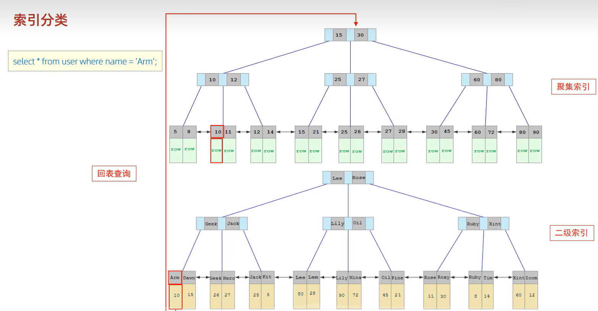

[TOC]


# 基础篇

## 第一章 初识MySQL

### 1.1 数据库分类
1. 关系型数据库：(SQL)
- MySQL, Oracle, Sql Server, DB2, SQLite
- 通过表和表之间，行和列之间的关系进行数据存储
2. 非关系型数据库 (not only SQL)
- Redis, MongDB
- 非关系型数据库，对象存储，通过对象自身的属性来决定
3. DBMS(数据库管理系统)
- 科学有效地管理数据，维护和获取数据。
### 1.2 MySQL
- 是一个关系型数据库管理系统
- 属于Oracle公司
- 开源，体积小，成本低，速度快
- **DBMS -> 多个数据库 -> 多张表**
## 第二章 下载安装
>安装之后：

    net start mysql
    mysql -u root -p123456
    net stop mysql
## 第三章 SQL语法
### 3.1 SQL通用语法
- 可以单行或多行书写，分号结尾
- 不区分大小写，关键字建议大写
- -- 或者 # 或者 /* */ 注释
- 可以使用空格或者缩进增强可读性
### 3.2 SQL分类
1. DDL：数据定义语言，定义数据库、表、字段
2. DML：数据操作语言，增删改
3. DQL：数据查询语言，查
4. DCL：数据控制语言，创建用户，控制权限
### 3.3 DDL
#### 3.3.1 DDL-数据库操作

    # 中括号中内容可选
    
    # 查询所有数据库
    SHOW DATABASES;
    
    # 查询当前数据库
    SELECT DATABASE();
    
    # 创建
    CREATE DATABASE [IF NOT EXISTS] 数据库名 [DEFAULT CHARSET 字符集] [COLLATE 排序规则];
    
    # 删除
    DROP DATABASE [IF EXISTS] 数据库名;
    
    # 使用
    USE 数据库名;
#### 3.3.2 DDL-表操作-查询

    # 查询当前数据库所有表
    SHOW TABLES;
    
    # 查询表结构
    DESC 表名;
    
    # 查询制定表的建表语句
    SHOW CREATE TABLE 表名;
#### 3.3.3 DDL-表操作-创建

    CREATE TABLE 表名(
        字段1 字段1类型[COMMENT 字段1注释],
        字段2 字段2类型[COMMENT 字段2注释],
        ...
        字段n 字段n类型[COMMENT 字段n注释]
    ) [COMMENT 表注释];
#### 3.3.4 DDL-表操作-数据类型
**1. 数字**


        # 年龄最多三位数，且一定是正整数
        age TINYINT UNSIGNED;
    
        # 分数最高100.0，下面的4代表长度，1代表小数点后几位
        score double(4, 1);
**2. 字符串类型**


- **上表的 varchar 是 可变长度，写错了**
- char(n) 固定长度，char(4)不管存入几个字符，都将占用4个字节，性能好
- varchar(n)是存入的实际字符数+1个字节（n<=255）或2个字节(n>255)，所以varchar(4),存入3个字符将占用4个字节，性能差
  

**3. 日期类型**

#### 3.3.5 DDL-表操作-修改

    # 添加字段
    ALTER TABLE 表名 ADD 字段名 类型(长度) [COMMENT 注释] [约束];
    
    # 修改数据类型
    ALTER TABLE 表名 MODIFY 字段名 新数据类型(长度);
    
    # 修改字段名和数据类型
    ALTER TABLE 表名 CHANGE 旧字段名 新字段名 类型(长度) [COMMENT 注释] [约束];
    
    # 删除字段
    ALTER TABLE 表名 DROP 字段名;
    
    # 修改表名
    ALTER TABLE 表名 RENAME TO 新表名;
#### 3.3.6 DDL-表操作-删除

    # 删除表
    DROP TABLE [IF EXISTS] 表名;
    
    # 删除指定表，并重新创建该表，只留下表结构，没有数据了
    TRUNCATE TABLE 表名;
### 3.4 DML
#### 3.4.1 DML-添加数据

    # 给指定字段添加数据
    INSERT INTO 表名(字段1, 字段2, ...) VALUES(值1, 值2, ...);
    
    # 给全部字段添加数据
    INSERT INTO 表名VALUES(值1, 值2, ...);
    
    # 批量添加数据
    INSERT INTO 表名(字段1, 字段2, ...) VALUES(值1, 值2, ...),(值1, 值2, ...)...;
    INSERT INTO 表名VALUES(值1, 值2, ...),(值1, 值2, ...)...;
#### 3.4.2 DML-修改数据
    UPDATE 表名 SET 字段名1=值1, 字段名2=值2, ... [WHERE 条件];
#### 3.4.3 DML-删除数据
    DELETE FROM 表名 [WHERE 条件];
### 3.5 DQL
#### 3.5.1 DQL语法
    SELECT 
        字段列表
    FROM
        表名列表
    WHERE
        条件列表
    GROUP BY
        分组字段列表
    HAVING
        分组后条件列表
    ORDER BY
        排序字段列表
    LIMIT
        分页参数
#### 3.5.2 DQL基本查询
    # 查询多个字段
    SELECT 字段1, 字段2, 字段3... FROM 表名;
    SELECT * FROM 表名; // 慎用
    
    # 设置别名
    SELECT 字段1[[AS] 别名1], 字段2[[AS] 别名2] ... FROM表名;
    
    # 去除重复记录
    SELECT DISTINCT 字段1, 字段2, 字段3... FROM 表名;
#### 3.5.3 DQL条件查询
    # 语法
    SELECT 字段1, 字段2, 字段3... FROM 表名 WHERE 条件列表;
    
    # 条件
    >, <, =, BETWEEN AND, IN(), LIKE 占位符, IS NULL, AND, OR, NOT

**注意：** 
- **BETWEEN AND 两端包含**
- **SELECT * FROM emp WHERE age in(10,19,20);**
- **占位符有：_ %, _数量严格，%表示任意数量字符**

        SELECT * FROM emp WHERE name like '___';  // 查名字是3个字
        SELECT * FROM emp WHERE idCard like '%9'; // 查结尾是9的
#### 3.5.4 DQL聚合函数
- 将一列数据作为整体，进行纵向计算
- 常见：count, max, min, avg, sum


        SELECT count(id) from emp;
        SELECT avg(age) from emp;
        SELECT min(age) from emp;
        SELECT max(age) from emp;

**注意：** 
- null 不参与计算
#### 3.5.5 DQL分组查询
    # 语法
    SELECT 字段列表 FROM 表名 [WHERE 条件] GROUP BY 分组字段名 [HAVING 分组后的过滤条件];
    
    select gender,avg(age) from emp where age < 19 group by gender having avg(age)>10;
**注意：** 
- **where 是分组之前进行过滤，不满足where的条件，不参与分组，HAVING则是分组之后过滤。**
- **where不能对聚合函数进行判断，而having可以。**
- **ONLY_FULL_GROUP_BY 模式下，使用 GROUP BY 子句进行分组查询时，SELECT 列表中的非聚合列必须包含在 GROUP BY 子句中。**
#### 3.5.5 DQL排序查询
    # 语法
    SELECT 字段列表 FROM 表名 ORDER BY 字段1 排序方式1, 字段2 排序方式2;
    
    select * from emp order by age asc, workNum desc;
    
    ASC 升序
    DESC 降序
#### 3.5.6 DQL分页查询
    # 语法
    SELECT 字段列表 FROM 表名 LIMIT 起始索引, 查询记录数;
    
    # 查询第2页员工数据，每页展示10条记录
    select * from emp limit 10,10;

**注意：** 
- **起始索引从0开始，起始索引=(查询页码-1)\*每页显示记录数**
- **分页查询是数据库方言，MySQL用的是LIMIT**
- **如果查询的是第一页数据，起始索引可以省略，直接简写为limit 10**
#### 3.5.6 DQL执行顺序

    FROM
        表名列表
    WHERE
        条件列表
    GROUP BY
        分组字段列表
    HAVING
        分组后条件列表 
    SELECT 
        字段列表
    ORDER BY
        排序字段列表
    LIMIT
        分页参数
### 3.6 DCL
#### 3.6.1 DCL-管理用户
    # 查询用户
    USE mysql;
    SELECT * FROM user;
    
    # 创建用户
    CREATE USER '用户名'@'主机名' IDENTIFIED BY '密码';
    
    # 修改用户密码
    ALTER USER '用户名'@'主机名' IDENTIFIED WITH mysql_native_password BY '新密码';
    
    # 删除用户
    DROP USER '用户名'@'主机名';
**注意：**
- **主机名可以用%表示任意主机**
#### 3.6.2 DCL-权限控制
    # 查询权限
    SHOW GRANTS FOR '用户名'@'主机名';
    
    # 授予权限
    GRANT 权限列表 ON 数据库名.表名 TO '用户名'@'主机名';
    
    # 撤销权限
    REVOKE 权限列表 ON 数据库名.表名 FROM '用户名'@'主机名';

## 第4章 函数
### 4.1 字符串函数
- **CONCAT(S1, S2,...):** 字符串拼接

- **LOWER(str):** 全部小写

- **UPPER(str):** 全部大写

- **LPAD(str, n, pad):** 左填充，用pad对str左侧填充，直到到达n个字符串长度

- **RPAD(str, n, pad):** 右填充，用pad对str右侧填充，直到到达n个字符串长度

- **TRIN(str):** 去掉字符串头尾空格

- **SUBSTRING(str, start, len):** 返回str从start位置开始len长度的子串

    ```SQL
    select lpad("01",5,"23");
    update emp set workNum = lpad(workNum, 5 , '0');
    ```
    
    
### 4.2 数值函数
- **CEIL(x):** 向上取整
- **FLOOR(x):** 向下取整
- **MOD(x, y):** 返回x/y的模
- **RAND():** 返回0~1内的随机数
- **ROUND(x, y):** 求参数x的四舍五入的值，保留y位小数

    ```
    select ceil(1.1);
    select lpad(round(rand()*1000000,0), 6, 0); // 六位随机数
    ```
    
    
### 4.3 日期函数
- **CURDATE():** 当前日期

- **CURTIME():** 当前时间

- **NOW():** 当前日期+时间

- **YEAR(date):** date的年 

- **MONTH(date):** 

- **DAY(date):** 

- **DATE_ADD(date, INTERVAL expr type):** 日期/时间 + 时间间隔 expr

- **DATEDIFF(date1, date2):** 时间间隔

    ```
    select date_add(now(), interval 510 day);   // 2025-03-31 09:30:30
    select datediff('2025-03-31', curdate());   // 510
    select name, datediff(curdate(),entryDate) as 'entrydates' from emp order by 'entrydates' desc;
    ```

    
### 4.4 流程控制函数
- **IF(value, t, f):** value 是 true，返回 t，否则返回 f
- **IFNULL(value1, value2):** 如果 value1 不为 null，返回 value1，否则value2
- **CASE WHEN [val1] THEN [res1]...ELSE[default] END:** 如果val1为true，返回res1，...否则返回默认值
- **CASE [wxpr] WHEN [val1] THEN [res1]...ELSE[default] END:** 如果expr是val1则返回res1，...否则返回默认值

    ```
    SELECT name, CASE WHEN age < 18 THEN '小年轻' WHEN age = 18 THEN '正好' ELSE '老东西' END FROM emp;
    ```

## 第5章 约束

### 5.1 约束概述

>概念：约束是作用于表中字段上的规则，用于限制存储在表中的数据
>
>目的：保证数据库中数据的正确性、有效性和完整性

| 约束                 | 描述                                                     | 关键字      |
| -------------------- | -------------------------------------------------------- | :---------- |
| 非空约束             | 限制该字段的数据不能为null                               | NOT NULL    |
| 唯一约束             | 保证该字段的所有数据都是唯一、不重复的                   | UNIQUE      |
| 主键约束             | 主键是一行数据的唯一标识，要求非空且唯一                 | PRIMARY KEY |
| 默认约束             | 保存数据时，如果未指定该字段的值，则采用默认值           | DEFAULT     |
| 检查约束（8.0.16后） | 保证字段值满足某一个条件                                 | CHECK       |
| 外键约束             | 用来让两张表的数据之间建立连接，保证数据的一致性和完整性 | FOREIGN KEY |

```sql
CREATE TABLE user (
    id int primary key auto_increment comment '主键',
    name varchar(10) not null unique comment '姓名',
    age int comment '年龄',
    status char(1) default '1' comment '状态',
    gender char(1) comment '性别'
) comment '用户表';

ALTER TABLE `user` CONVERT TO CHARACTER SET utf8;
```

### 5.2 外键约束

> 外键：用来让两张表的数据之间建立连接，保证数据的一致性和完整性。
>
> 子表：有外键的那张表
>
> 父表：子表关联的那张表

```
# 添加外键
ALTER TABLE 表名 ADD CONSTRAINT 外键名称 FOREIGN KEY(外键字段名) REFERENCES 主表(主表列名);

# 删除外键
ALTER TABLE 表名 FROP FOREIGN KEY 外键名称;
```

| 行为        | 说明                                                         |
| ----------- | ------------------------------------------------------------ |
| NO ACTION   | 当在父表中删除/更新对应记录时，首先检查该记录是否有对应外键，如果有则不允许删除/更新。（类RESTRICT） |
| RISTRICT    | 当在父表中删除/更新对应记录时，首先检查该记录是否有对应外键，如果有则不允许删除/更新。（类NO ACTION） |
| CASCADE     | 当在父表中删除/更新对应记录时，首先检查该记录是否有对应外键，如果有则也删除/更新子表中的**整条记录**。 |
| SET NULL    | 当在父表中删除对应记录时，首先检查该记录是否有对应外键，如果有则设置子表中该外键的值为null。 |
| SET DEFAULT | 父表有变更时，子表将外键列设置成一个默认的值。（Innodb不支持） |

```
ALTER TABLE 表名 ADD CONSTRAINT 外键名称 FOREIGN KEY(外键字段名) REFERENCES 主表(主表列名) ON UPDATE CASCADE ON DELETE CASCADE;
```

## 第6章 多表查询

### 6.1 多表关系

#### 6.1.1 一对多

- 案例：部门-员工
- 实现：在多的一方建立外键

#### 6.1.2 多对多

- 案例：学生-课程
- 实现：建立第三张中间表，中间表至少包含两个外键，分别关联两方主键

#### 6.1.3 一对一

- 案例：用户-用户详情
- 关系：多用于多表拆分
- 实现：在任意一方加入外键，关联另一方的主键，并设置外键为unique

### 6.2 多表查询概述

#### 6.2.1 概述

- 概述：指从多张表中查询数据
- 笛卡尔积：两个集合A B的所有组合情况。多表查询要消除。

```
select * from t1, t2;	# 产生笛卡尔积
select * from t1, t2 where t1.t2_id = t2.id;  	#消除笛卡尔积
```

#### 6.2.2 分类

1. **连接查询**

   - 内连接：查AB交集
   - 外连接：
     - 左外连接：查询左表所有数据和交集
     - 右外连接：查询右表所有数据和交集

   - 自连接：当前表与自身的连接查询，自连接必须使用别名

2. **子查询**

### 6.3 内连接

```
# 隐式内连接
SELECT 字段列表 FROM 表1, 表2 WHERE 条件;

# 显式内连接
SELECT 字段列表 FROM 表1 [INNER] JOIN 表2 ON 连接条件;
```

```
# 隐式
select * from emp, dept where emp.dept_id = dept.id;
select * from emp e, dept d where e.dept_id = d.id;

# 显式
select e.name, d.name from emp e inner join dept d on e.dept_id = d.id;
```

### 6.4 外连接

```
# 左外连接
SELECT 字段列表 FROM 表1 LEFT [OUTER] JOIN 表2 ON 条件;
select * from emp e left join test.dept d on d.id = e.dept_id;

# 右外连接
SELECT 字段列表 FROM 表1 RIGHT [OUTER] JOIN 表2 ON 条件;
select * from emp e right join test.dept d on d.id = e.dept_id;
```

###  6.5 自连接

> 在自连接时，虽然只有一张表，但是把它看作两张表

```
# 自连接
SELECT 字段列表 FROM 表1 别名1 JOIN 表1 别名2 ON 条件;
```

```
# 查询员工以及其所属领导的名字
# 内连接实现，如果无领导，则不显示
select e1.name, e2.name from emp e1 join emp e2 on e1.managerID = e2.id;

# 左外连接实现，就算无领导，也显示
select e1.name, e2.name from emp e1 left join emp e2 on e1.managerID = e2.id;
```

### 6.6 联合查询-union， union all

- union查询：把多次查询的结果合并起来并去重，形成一个新的查询结果集
- union all查询：合并但是不去重

```
# 语法
SELECT 字段列表 FROM 表1 WHERE 条件1 ...
UNION [ALL]
SELECT 字段列表 FROM 表2 WHERE 条件2 ...;

# 举例
select emp.name from emp where salary < 4000
union
select emp.name from emp where age > 30;
```

**注意：**

- **多张表的列数和字段类型必须一致**

### 6.7 子查询

#### 6.7.1 子查询概述

- 概念：SQL语句中嵌套SELECT语句，成为嵌套查询，也叫子查询

- 范围：子查询的外部语句可以是 INSERT / UPDATE / DELETE / SELECT 中的任何一个

  ```
  # 语法
  SELECT * FROM t1 WHERE column1 = (SELECT column1 FROM t2)
  ```

  

- 分类1：
  - 标量子查询：结果为单个值
  - 列子查询：结果为一列
  - 行子查询：结果为一行
  - 表子查询：结果为多行多列

- 分类2：
  - WHERE 之后出现的子查询
  - FROM 之后出现的子查询
  - SELECT 之后出现的子查询

#### 6.7.2 标量子查询

```
# 查询销售部员工信息
# 一步一步查询
select id from dept where name = '销售部';
select * from emp where dept_id = 4;

# 使用子查询
select * from emp where dept_id = (select id from dept where name = '销售部');

# 其他应用
select * from emp where entryDate > (select entryDate from emp where name = '杨过');
```

#### 6.7.3 列子查询

> 常用操作符：IN, NOT IN, ANY, SOME, ALL

| 操作符 | 描述                                        |
| ------ | ------------------------------------------- |
| IN     | 在指定的集合范围内，多选一                  |
| NOT IN | 不在指定的集合范围之内                      |
| ANY    | 子查询返回列表中，有任意一个满足即可        |
| SOME   | 与 ANY 等同，使用 SOME 的地方都可以使用 ANY |
| ALL    | 子查询返回列表的所有值都必须满足            |

```
# 查询销售部和市场部的所有人信息
# 一步一步查询
select id from dept where name = '销售部' or name = '市场部';	// 2,4
select * from emp where dept_id in (2,4);

# 使用子查询
select * from emp where dept_id in (select id from dept where name = '销售部' or name = '市场部');

# 返回比财务部所有人工资都高的员工信息
select * from emp where salary > all (select salary from emp where dept_id = (select id from dept where name = '财务部'));
```

#### 6.7.4 行子查询

```
# 查询和段誉的薪资一样，领导也一样的所有人的信息
# 一步一步查询
select salary, managerID from emp where name = '段誉';
select * from emp where (salary, managerID) = (4000, 5);

# 使用子查询
select * from emp where (salary, managerID) = (select salary, managerID from emp where name = '段誉');
```

#### 6.7.5 表子查询

> 常用操作符：IN

```
# 查询与乔峰，小龙女职位薪资都相同的员工信息
select * from emp where (job, salary) in (select job, salary from emp where name = '乔峰' or name = '小龙女');

# 查询在2023-01-05之后入职的员工信息和他们的部门信息
select e.*, d.name from (select * from emp where entryDate > '2023-01-05
2023-01-05') e left join dept d on e.dept_id = d.id;
```

#### 6.7.6 案例

```
# 1. 查询员工的姓名、年龄、职位和部门信息
select e.name, e.age, e.job, d.name from emp e,dept d where e.dept_id = d.id;

# 2. 查询年龄小于30岁的员工的姓名、年龄、职位和部门信息
select e.name, e.age, e.job, d.name from emp e inner join test.dept d on e.dept_id = d.id where e.age < 30;

# 3. 查询拥有员工的部门id, name
select dept.id, dept.name from dept where dept.id in (select dept_id from emp);	// 子查询
select distinct d.id, d.name from emp e, dept d where e.dept_id = d.id;			// 隐式内连接

# 4. 查询年龄大于30的员工信息及部门名称，没部门也显示
select e.*, d.name from emp e left join test.dept d on d.id = e.dept_id where e.age > 30;

# 5. 查询员工薪资等级
select e.name, s.grade from emp e, salayGrade s where e.salary > s.low and e.salary < s.high;

# 6. 查询研发部所有员工信息和工资等级
# 指令1没有用distinct而指令2用了distinct，因为指令2缺少e.dept_id = d.id，实际上没有把dept表关联起来，产生了笛卡尔积
# 连接n张表，至少要用n - 1个条件
# 指令1
select e.name, s.grade from emp e, salayGrade s,dept d where e.salary > s.low and e.salary < s.high and e.dept_id = d.id and d.name = '研发部';
# 指令2
select distinct  e.name, s.grade from emp e, salayGrade s,dept d where e.salary > s.low and e.salary < s.high and e.dept_id = (select id from dept where name = '研发部');

# 7. 查询研发部的平均工资
select avg(e.salary) from emp e, dept d where e.dept_id = d.id and d.name = '研发部';

# 8. 查询工资比小龙女高的员工信息
select * from emp where emp.salary > (select salary from emp where emp.name = '小龙女');

# 9. 查询比平均工资高的员工信息
select * from emp e where salary > (select avg(salary) from emp);

# 10. 查询低于本部门平均工资的员工信息
# 法1：列出一张部门薪资平均表
select *
from emp e,
     (select e.dept_id, avg(salary) c
      from emp e,
           dept d
      where e.dept_id is not null
      group by e.dept_id) t
where e.dept_id = t.dept_id
  and e.salary < t.c;
  
# 法2：每次查询该部门平均薪资
select *
from emp e1
where e1.salary < (select avg(e2.salary) from emp e2 where e2.dept_id = e1.dept_id);

# 11. 查询所有的部门信息，并统计部门的员工人数
# 法1：建立新表
select d.id, d.name, t.c
from dept d,
     (select count(*) c, emp.dept_id from emp where emp.dept_id is not null group by emp.dept_id) t
where d.id = t.dept_id;

# 法2：直接查询
select d.id, d.name, (select count(*) from emp where emp.dept_id = d.id)
from dept d;

# 12. 查询所有学生的选课情况，展示学生姓名、学号、课程名称
# 三张表：student, course, student_course
select s.name, s.number, c,name 
from student s,
	course c, 
	student_course sc 
where s.id = sc.studentID 
	and c.id = sc.courseID;
```

## 第7章 事务

### 7.1 简介

> 概念：事务是一组操作的集合，是一个不可分割的单位，事务会把所有的操作作为一个整体一起向系统提交或撤销操作请求，即这些操作**要么同时成功，要么同时失败**。

> 案例：银行转账

### 7.2 操作

> 演示：

```
# 1. 创建表格，插入数据
create table account (
    id int auto_increment primary key comment "主键id",
    name varchar(10) comment "姓名",
    money int comment "余额"
) comment "账户表";

ALTER TABLE `account` CONVERT TO CHARACTER SET utf8;

insert into account(id, name, money) values (null,"张三",2000), (null,"李四",2000);

# 2. 转账操作
## 1.1 查询张三余额
select * from account where name = "张三";

## 1.2 张三余额-1000
update account set money = money - 1000 where name = "张三";

程序异常... # 这条程序语法检测出问题，上面的执行，下面的不执行

## 1.3 李四余额+1000
update account set money = money + 1000 where name = "李四";

# 3. 恢复操作
update account set money = 2000 where name = "李四" or name = "张三";
```

> 事务操作：

**方式1：**

```
# 查看/设置事务提交方式
SELECT @@autocommit;
SET @@autocommit = 0;

# 提交事务
COMMIT;

# 回滚事务
ROLLBACK;
```

```
# 查看事务提交方式
SELECT @@autocommit;	# 1

# 设置事务提交方式
SET @@autocommit = 0;

# 查看事务提交方式
SELECT @@autocommit;	# 0

#-------------------------------------正常----------------------------------------------

# 2. 转账操作
## 1.1 查询张三余额
select * from account where name = "张三";

## 1.2 张三余额-1000
update account set money = money - 1000 where name = "张三";

## 1.3 李四余额+1000
update account set money = money + 1000 where name = "李四";		# 表中数据不变

# 提交事务
COMMIT;		# 表中数据改变

#-------------------------------------异常----------------------------------------------

# 2. 转账操作
## 1.1 查询张三余额
select * from account where name = "张三";

## 1.2 张三余额-1000
update account set money = money - 1000 where name = "张三";

........sdas.d.a.s.asd.as.da.s.da.s.d.as.d.as.d.as.d.a.sd.a.s.da.s 	# 出错

## 1.3 李四余额+1000
update account set money = money + 1000 where name = "李四";		# 表中数据不变

# 回滚事务
ROLLBACK;	# 表中数据不变
```

**方式2：**

```
# 开启事务
START TRANSACTION 或 BEGIN;

# 提交事务
COMMIT;

# 回滚事务
ROLLBACK;
```

```
# 开启事务
START TRANSACTION;

# 2. 转账操作
## 1.1 查询张三余额
select * from account where name = "张三";

## 1.2 张三余额-1000
update account set money = money - 1000 where name = "张三";

update ........	# 出错

## 1.3 李四余额+1000
update account set money = money + 1000 where name = "李四";

commit;		# 无报错，提交，结束事务

ROLLBACK;	# 有报错，回滚，结束事务
```

### 7.3 事务四大特性

1. 原子性：是一个不可分割的单位，操作要么同时成功，要么同时失败
2. 一致性：事务完成时，必须使所有数据都保持一致状态
3. 隔离性：数据库系统提供的隔离机制，保证事务在不受外部并发操作影响的独立环境下运行
4. 持久性：事务一旦提交或回滚，它对数据库中的数据的改变就是永久的

### 7.4 并发事务问题

| 问题       | 描述                                                         |
| ---------- | ------------------------------------------------------------ |
| 脏读       | 一个事物读到另一个事务还没有提交的数据                       |
| 不可重复读 | 一个事务先后读取同一条记录，但两次读取的数据不同，称之为不可重复读 |
| 幻读       | 一个事务按照条件查询数据时，没有对应的数据行，但是在插入数据时，又发现这行已经存在，如同“幻影” |

### 7.5 事务的隔离级别

| 隔离级别                | 脏读 | 不可重复读 | 幻读 |
| ----------------------- | ---- | ---------- | ---- |
| Read uncommited         | √    | √          | √    |
| Read commited           | ×    | √          | √    |
| Repeatable Read（默认） | ×    | ×          | √    |
| Serializable            | ×    | ×          | ×    |

**注意：**

- 隔离级别越来越高，性能越来越差

```
# 查看事务隔离级别
SELECT @@TRANSACTION_ISOLATION

# 设置事务隔离级别
SET [SESSION|GLOBAL] TRANSACTION ISOLATION LEVEL {Read uncommited | Read commited | Repeatable Read | Serializable}
```

# 进阶篇

## 第1章 存储引擎

### 1.1 MySQL 体系结构


- 连接层
- 服务层
- **引擎层**
- 存储层

### 1.2 存储引擎简介

> 存储引擎就是存储数据、建立索引、更新 / 查询数据等技术的实现方式。存储引擎是基于表的，而不是基于库的，所以存储引擎也可被称为表类型。

```
# 创建表时，指定存储引擎
CREATE TABLE 表名(
	字段1 类型1,
	...
)ENGINE={INNODB|MEMORY|MYISAM...};
```

### 1.3 存储引擎特点

#### 1.3.1 InnoDB

- 介绍：
  - 兼顾高可靠性和高性能，5.5后默认
- 特点：
  - DML遵循ACID模型（即事务四大特性），支持**事务**
  - **行级锁**，提高并发访问特性
  - 支持**外键**约束

- 文件：
  - **文件 xxx.ibd:** xxx是表名，InnoDB引擎的每张表都会对应这样一个表空间文件，存储该表的表结构(frm, sdi)，数据和索引。
  - **参数：**innodb_file_per_table

- 逻辑存储结构：
  - 表空间 - 段 - 区 - 页 - 行

#### 1.3.2 MyISAM

- 介绍：
  - MySQL早期默认的存储引擎
- 特点：
  - 不支持事务和外键
  - 支持表锁，不支持行锁
  - 访问速度快
- 文件：
  - xxx.sdi: 存储表结构信息
  - xxx.MYD: 存储数据
  - xxx.MYI: 存储索引

#### 1.3.3 Memory

- 介绍：
  - 存储在内存中，收到硬件或断电影响，只能作为临时表或缓存使用
- 特点：
  - 内存存放
  - hash索引（速度快）
  - 表大小有限制
- 文件：
  - xxx.sdi: 存储表结构信息

### 1.4 存储引擎选择

- InooDB：对事务完整性要求高，并发一致性，数据除了插入、查询，还有很多更新、删除时
- MyISAM: 插入、查询为主，对事务完整性、并发性要求不高时
- Memory: 临时表、缓存

## 第2章 索引

### 2.1 索引概述

- 概念：索引是帮助MySQL高效获取数据的有序数据结构。
- 优点：
  - 提高检索效率，降低数据库IO成本
  - 通过索引列对数据排序，降低数据排序成本，降低CPU消耗
- 缺点：
  - 索引列占空间
  - 降低了更新表的速度，INSERT, UPDATE, DELETE 的效率变低

### 2.2 索引结构

#### 2.2.1 不同的索引

- MySQL的索引是在存储引擎层实现的，存储引擎不同则索引结构不同。

| 索引结构             | 描述                                                         |
| -------------------- | ------------------------------------------------------------ |
| **B+Tree 索引**      | 最常见                                                       |
| Hash 索引            | 底层用Hash, 只有精确匹配索引列的查询才有效，不支持范围查询   |
| R-Tree (空间索引)    | 空间索引是MyISAM引擎的一个特殊索引类型，主要用于地理空间数据类型 |
| Full-text (全文索引) | 通过建立倒排索引，快速匹配文档的方式，类似于Lucense, Solr, ES |

#### 2.2.2 B Tree（多路平衡查找树）

> 二叉树缺点：顺序存储形成链表，检索变慢
>
> 红黑树缺点：大数据量情况下，层级较深，检索变慢
>
> 引出B-Tree：下面是一棵五阶B树，最大度数（子节点数）为5，最大Key的数目是4


#### 2.2.3 B+Tree 索引

> B+树：所有元素都在叶子节点，且在叶子节点有序
>
> MySQL索引数据结构对经典的B+树进行了优化，增加了一个指向相邻叶子结点的链表指针，形成了有顺序指针的B+树

- **经典B+Tree：**


- **MySQL索引数据结构：**


#### 2.2.4 Hash 索引

> 采用一定的Hash算法，将键值换算成新的Hash值，映射到对应的槽位上，然后存储在Hash表中
>
> 如果两个键值映射到同一个槽位上，产生了Hash冲突，可以通过链表解决

- 特点：
  - 只能用于对等比较（=, in），不支持范围查询（between, >, <）
  - 无法利用索引完成排序操作
  - 查询效率高，通常只需要一次检索就可以了

- 支持：、
  - 只有Memory支持
  - InnoDB拥有自适应hash功能

### 2.3 索引分类

- **整体分类：**

| 分类     | 含义                                   | 特点                     | 关键字   |
| -------- | -------------------------------------- | ------------------------ | -------- |
| 主键索引 | 针对于表中主键创建的索引               | 默认自动创建，只能有一个 | PRIMARY  |
| 唯一索引 | 避免同一个表中某数据列中的值重复       | 可以有多个               | UNIQUE   |
| 常规索引 | 快速定位特定数据                       | 可以有多个               |          |
| 全文索引 | 查找的是文本中的关键词，而非索引中的值 | 可以有多个               | FULLTEXT |

- **InnoDB 中的分类：**

| 分类                        | 含义                                                 | 特点           |
| --------------------------- | ---------------------------------------------------- | -------------- |
| 聚集索引（Clustered Index） | 存储与索引在一起，索引结构的叶子节点保存了数据       | 必须有，仅一个 |
| 二级索引（Secondary Index） | 存储与索引分开，索引结构的叶子节点关联的是对应的主键 | 可以有多个     |

- **聚集索引的选取规则：**

  - 存在主键，则主键索引就是聚集索引

  - 不存在主键，则第一个唯一索引作为聚集索引

  - 无主键，无唯一索引，则自动生成一个rowid作为隐藏的聚集索引

- **实例演示：**

  > 先在name对应的二级索引中查询‘Arm’，找到了主键10，再在聚集索引中查询10，得到全部信息。

  

### 2.4 索引语法

```
# 创建索引
CREATE [UNIQUE|FULLTEXT] INDEX index_name ON table_name(index_col_name, ...);

# 查看索引
SHOW INDEX FROM table_name;

# 删除索引
DROP INDEX index_name ON table_name;
```

### 2.5 SQL 性能分析

- SQL 执行频率

  ```
  # 查询不同功能的使用频率
  SHOW GLOBAL STATUS LIKE 'Com_';
  ```

- 慢查询日志

  > 记录了所有执行时间超过指定参数（long_query_time, 单位：秒，默认10秒）的所有SQL语句的日志
  >
  > MySQL的慢查询日志默认没有开启，需要在配置文件（/etc/my.cnf）中配置

  ```
  # 产看慢查询日志是否开启
  SHOW VARIABLES LIKE 'slow_query_log';
  
  # 开启慢查询日志（在配置文件中修改）
  slow_query_log=1
  # 设置慢日志的时间为2s，SQL语句执行时间超过2s，则视为慢查询
  long_query_time=2
  ```

- profile 详情

  > 能在做SQL优化时帮助我们了解时间都耗费到哪里去了

  ```
  # 查看是否支持
  SELECT @@HAVE_PROFILING;
  
  # 开关
  SET profiling=1;
  
  # 产看每一条SQL的耗时基本情况
  SHOW PROFILE;
  
  # 查看指定 query_id 的SQL语句CPU使用情况
  SHOW PROFILE [CPU] FOR QUERY query_id;
  ```

- explain 执行计划

  > EXPLAIN, DESC 命令获取MySQL如何执行SELECT语句的信息，包括在执行中表如何连接和连接的顺序

  ```
  # 语法
  EXPLAIN SELECT ...;
  ```

  - **Id:** select查询的序列号，执行子句或操作表的顺序。id相同，从上到下；id不同，先大后小。
  - select_type: 类型
  - **type:** 连接类型，性能由好到差是 NULL, system, const, eq_ref, ref, range, index, all
  - possible_key: 显示可能用到的索引
  - key: 实际使用的索引
  - key_len: 索引使用的字节数
  - rows: 执行查询的行数的预估值
  - filtered: 返回结果的行数占需读取行数的百分比，越大越好
  - extra: 额外信息

### 2.6 索引使用

