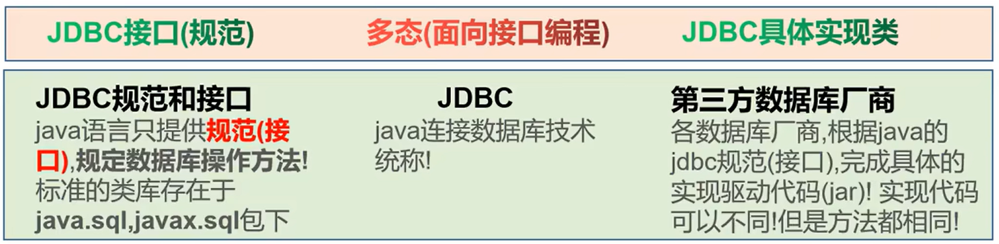
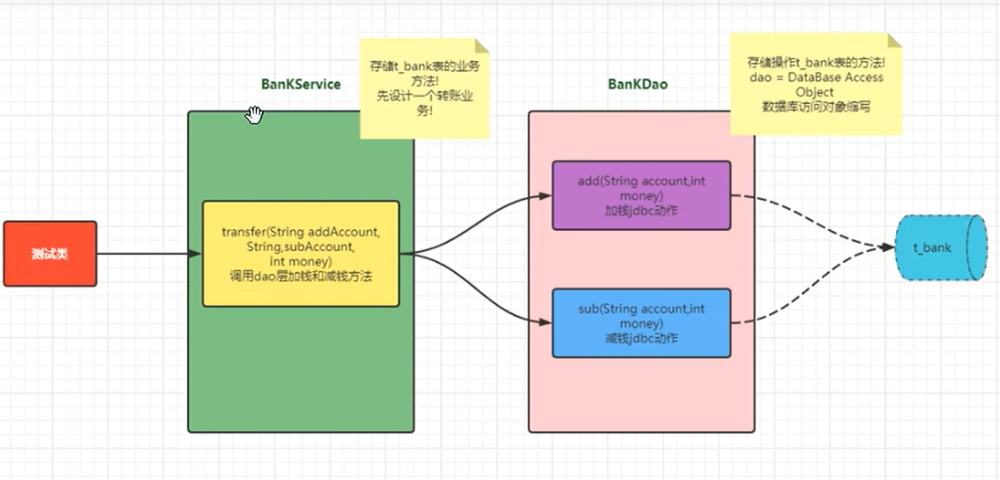

# JDBC

## 第1章 开篇介绍

### 1.1 JDBC 技术概念和理解

- Java Database Connectivity：Java连接数据库技术。
- 是Java与数据库的必要纽带
- 是数据库层框架（Mybatis, HIBERNATE, Spring Data JPA）底层原理




- 优势：
  - 只需要学习JDBC接口规定方法，即可操作所有数据库软件
  - 项目中期需要切换数据库，只需要更新第三方驱动jar包，不需要改代码

### 1.2 JDBC 核心 API 介绍和使用路线

- 技术组成：
  - jdk下JDBC规范接口，存储在java.sql和javax.sql包中的api，**只需要学这个**
  - 各个数据库厂商提供的驱动jar包

- 设计的核心类和接口
  - DriverManager：负责第三方jar包注册；负责根据数据库连接信息获取connection
  - Connection：和数据库建立的连接，在连接对象上，可以多次curd；可以获取statement, preparedstatement, callablestatement对象
  - Statement|**Preparedstatement**|Callablestatement：具体发送SQL语句到数据库管理软件的对象；
  - ResultSet：存储DQL查询数据库结果的对象；面向对象思维的产物（抽象成数据库的查询结果表）

- 使用路线：
  - 静态SQL路线（没有动态值语句）：DriverManager -> Connection -> Statement -> ResultSet
  - 预编译SQL路线（有动态值语句）：DriverManager -> Connection -> Preparedstatement -> ResultSet
  - 执行标准存储过程SQL语句：DriverManager -> Connection -> Callablestatement -> ResultSet

## 第2章 JDBC 核心API

### 2.1 引入jar包

> 下载zip，解压得文件夹，里面的jar包复制到项目的lib目录中，har包 add as adictionary，观察到jar包能展开看到下级目录则成功

### 2.2 步骤总结

> 注意回忆那张抽象的图

1. 注册驱动 DriverManager
2. 创建连接 Connection
3. 创建发送SQL语句对象 Statement
4. 发送SQL语句，获取结果 Resultset
5. 结果解析
6. 释放资源

### 2.3 基于statement演示查询

```
package com.jdbc.api.statement;

import com.mysql.cj.jdbc.Driver;

import java.sql.*;

public class StatementQueryPart {
    public static void main(String[] args) throws SQLException {
        // 1. 注册驱动，注意！
        DriverManager.registerDriver(new Driver());

        // 2. 获取连接
        Connection connection =
                DriverManager.getConnection("jdbc:mysql://127.0.0.1:3306/test", "root", "123456");

        // 3. 创建statement
        Statement statement = connection.createStatement();

        // 4. 发送sql语句，并获取返回结果
        String sql = "select * from t_user;";
        ResultSet resultSet = statement.executeQuery(sql);

        // 5. 结果解析
        while (resultSet.next()) {
            int  id = resultSet.getInt("id");
            String account = resultSet.getString("account");
            String password = resultSet.getString("password");
            String nickname = resultSet.getString("nickname");
            System.out.println(id+"--"+account+"--"+password+"--"+nickname);
        }

        // 6. 释放资源
        resultSet.close();
        statement.close();
        connection.close();
    }
}
```

**注意：**

- JDBC 8+ 版本，导入的是com.mysql.cj.jdbc.Driver

### 2.4 基于statement方式的问题

```
package com.jdbc.api.statement;

// 输入账号密码，查询t_user，反馈登录是否成功

import com.mysql.cj.jdbc.Driver;

import java.sql.*;
import java.util.Scanner;

public class StatementUserLoginPart {
    public static void main(String[] args) throws SQLException, ClassNotFoundException {
        // 1. 键盘输入事件，手机账号密码信息
        Scanner scanner = new Scanner(System.in);
        System.out.println("请输入账号");
        String account = scanner.nextLine();
        System.out.println("请输入密码");
        String password = scanner.nextLine();

        // 2. 注册驱动
        Class.forName("com.mysql.cj.jdbc.Driver");  // 触发类加载，触发静态代码块的调用

        // 3. 获取连接
        Connection connection =
                DriverManager.getConnection("jdbc:mysql://127.0.0.1:3306/test", "root", "123456");

        // 4. 创建statement
        Statement statement = connection.createStatement();

        // 5. 发送sql语句，返回结果
        String sql = "select * from t_user where account = '" + account + "' and password = '" + password + "';";
        ResultSet resultSet = statement.executeQuery(sql);
		
		// 5. 结果解析
        if (resultSet.next()) {
            System.out.println("登录成功");
            int  id = resultSet.getInt("id");
            String account1 = resultSet.getString("account");
            String password1 = resultSet.getString("password");
            String nickname = resultSet.getString("nickname");
            System.out.println(id+"--"+account1+"--"+password1+"--"+nickname);
        } else {
            System.out.println("登录失败");
        }

        // 7. 释放资源
        resultSet.close();
        statement.close();
        connection.close();
    }
}

```

- **问题1：原注册驱动代码注册了两次驱动**

  ```
  // 法1: 原注册驱动代码
  DriverManager.registerDriver(new Driver());
  ```

  1. DriverManager.registerDriver(); 方法本身注册一次
  2. Driver.static{DriverManager.registerDriver()} 静态代码块也注册一次

  - 解决方案：只触发静态代码块 -> 类加载的时候，会触发静态代码块 ->七种方法触发类加载：
    1. new
    2. 调用静态方法
    3. 调用静态属性
    4. 接口
    5. 反射
    6. 子类触发父类
    7. 程序的入口main

  ```
  // 法2: new. 不灵活
  new Driver();
  
  // 法3: 反射。可以提取字符串，将来换数据库时改动字符串即可，灵活
  Class.forName("com.mysql.cj.jdbc.Driver");
  ```

- **问题2：获取连接DriverManager.getConnection()是一个重载方法，也即它有1,2,3个参数的3种类型**

  - 三个参数：

    ```
    url:  jdbc:数据库管理软件名称://ip地址|主机名称:端口号/数据库名?key=value&key=value
    user
    password
    ```

  - 两个参数：

    ```
    url：同上
    Properties info：传进去一个对象，繁琐
    ```

  - 一个参数：

    ```
    url：jdbc:数据库管理软件名称://ip地址|主机名称:端口号/数据库名?user=root&password=123456
    ```

- **问题3：statement.executeQuery(sql) 和 statement.executeUpdate(sql) 的区别**
  
  - 前者sql语句是SELECT，返回resultSet
  - 后者sql语句是非SELECT，如果sql是DML，返回改变的行数；如果sql不是DML，返回0
- **问题4：ResultSet 数据解析**
  
  - 需要移动游标指定数据行，游标默认在第一行数据之前，调用next()方法向后移动，返回boolean。（还有其他移动方式）
  - 获取指定数据行的列数据，获取光标指定的行的列数据

- **问题5：sql语句用字符串拼接**

  - 字符串拼接麻烦
  - 只能拼接字符串类型，其他数据类型无法处理
  - **可能发生注入攻击**：动态值充当了查询结果，影响了原有的查询结果。上面例子里，密码传入' or '1' = '1就一定成功。

  因此需要用PreparedStatement优化

### 2.5 基于PreparedStatement方式优化

- **PreparedStatement过程：**
  1. 编写 sql 语句结果，不包含动态值部分的语句，动态值部分用 ? 代替。
  2. 创建预编译preparedStatement，并设置SQL语句结果
  3. 动态值赋值
  4. 发送 sql 语句，获取返回值
- **防止注入攻击原因：**
  - 预先知道结构

```
package com.jdbc.api.preparedstatement;

/*
* 防止注入攻击，演示ps使用流程
* */

import java.sql.*;
import java.util.Scanner;

public class PreparedStatementUserLoginPart {
    public static void main(String[] args) throws ClassNotFoundException, SQLException {
        // 1. 键盘输入事件，手机账号密码信息
        Scanner scanner = new Scanner(System.in);
        System.out.println("请输入账号");
        String account = scanner.nextLine();
        System.out.println("请输入密码");
        String password = scanner.nextLine();

        // 2. 注册驱动
        Class.forName("com.mysql.cj.jdbc.Driver");  // 触发类加载，触发静态代码块的调用

        // 3. 获取连接
        Connection connection =
                DriverManager.getConnection("jdbc:mysql://127.0.0.1:3306/test", "root", "123456");

        // 4. 编写sql语句
        String sql = "select * from t_user where account = ? and password = ?;";

        // 5. 创建预编译preparedStatement，并设置SQL语句结果
        PreparedStatement preparedStatement = connection.prepareStatement(sql);

        // 6. 单独的占位符赋值
        preparedStatement.setObject(1,account);
        preparedStatement.setObject(2,password);

        // 7. 发送sql语句，返回结果
        ResultSet resultSet = preparedStatement.executeQuery();

        // 8. 结果解析
        if (resultSet.next()) {
            System.out.println("登陆成功");
        } else {
            System.out.println("登录失败");
        }

        // 9. 释放资源
        resultSet.close();
        preparedStatement.close();
        connection.close();
    }
}
```

### 2.6 基于PreparedStatement方式演示curd

```
package com.jdbc.api.preparedstatement;

import com.mysql.cj.jdbc.Driver;
import org.junit.Test;

import java.sql.*;
import java.util.ArrayList;
import java.util.HashMap;
import java.util.List;
import java.util.Map;

public class PreparedStatementCurdPart {
    @Test
    public void testInsert() throws ClassNotFoundException, SQLException {
        Class.forName("com.mysql.cj.jdbc.Driver");
        Connection connection =
                DriverManager.getConnection("jdbc:mysql://127.0.0.1:3306/test", "root", "123456");
        String sql = "insert into t_user(account,password,nickname) values(?,?,?);";
        PreparedStatement preparedStatement = connection.prepareStatement(sql);
        preparedStatement.setObject(1,"test");
        preparedStatement.setObject(2,"111111");
        preparedStatement.setObject(3,"狗");
        int i = preparedStatement.executeUpdate();

        if (i > 0) System.out.println("修改成功");
        else System.out.println("修改失败");

        preparedStatement.close();
        connection.close();
    }

    @Test
    public void testUpdate() throws ClassNotFoundException, SQLException {
        Class.forName("com.mysql.cj.jdbc.Driver");
        Connection connection =
                DriverManager.getConnection("jdbc:mysql://127.0.0.1:3306/test", "root", "123456");
        String sql = "update t_user set nickname = ? where id = 3";
        PreparedStatement preparedStatement = connection.prepareStatement(sql);
        preparedStatement.setObject(1,"二狗子");
        int i = preparedStatement.executeUpdate();

        if (i > 0) System.out.println("修改成功");
        else System.out.println("修改失败");

        preparedStatement.close();
        connection.close();
    }

    @Test
    public void testDelete() throws ClassNotFoundException, SQLException {
        Class.forName("com.mysql.cj.jdbc.Driver");
        Connection connection =
                DriverManager.getConnection("jdbc:mysql://127.0.0.1:3306/test", "root", "123456");
        String sql = "delete from t_user where id = ?;";
        PreparedStatement preparedStatement = connection.prepareStatement(sql);
        preparedStatement.setObject(1,3);
        int i = preparedStatement.executeUpdate();

        if (i > 0) System.out.println("删除成功");
        else System.out.println("删除失败");

        preparedStatement.close();
        connection.close();
    }

    @Test
    public void testSelect() throws ClassNotFoundException, SQLException {
        Class.forName("com.mysql.cj.jdbc.Driver");
        Connection connection =
                DriverManager.getConnection("jdbc:mysql://127.0.0.1:3306/test", "root", "123456");
        String sql = "select id, account, password, nickname from t_user;";
        PreparedStatement preparedStatement = connection.prepareStatement(sql);
        ResultSet resultSet = preparedStatement.executeQuery();

        // 法1：手动取值
//        List< Map > list1 = new ArrayList<Map>();
//        Map map1 = new HashMap<>();
//        while (resultSet.next()) {
//            map1.put("id",resultSet.getInt("id"));
//            map1.put("account",resultSet.getString("account"));
//            map1.put("password",resultSet.getString("password"));
//            map1.put("nickname",resultSet.getString("nickname"));
//            list1.add(map1);
//        }
        // 法2：获取列的信息
        ResultSetMetaData metaData = resultSet.getMetaData();
        int columnCount = metaData.getColumnCount();
        List< Map > list2 = new ArrayList<Map>();
        Map map2 = new HashMap<>();
        while (resultSet.next()) {
            for (int i = 1; i <= columnCount; i++) {
                Object value = resultSet.getObject(i);
                String columnLabel = metaData.getColumnLabel(i);
                map2.put(columnLabel,value);
            }
            list2.add(map2);
            System.out.println(map2);
        }
    }
}
```

## 第3章  JDBC 扩展提升

### 3.1 自增长主键回显

- **概念：**java 程序获取插入数据时，数据库自增长的主键 id 值。
- **作用：**多表关联场景下，主表插入数据时主键自增长，插入前不知道这条数据的主键，但是从表需要在插入数据之前就绑定主表的主键，这时候就可以使用主键回显技术。

- **实现：**preparedStatement 在定义时加入参数，让其带回自增的主键

  ```
  # 举例
  PreparedStatement preparedStatement = connection.prepareStatement(sql,Statement.RETURN_GENERATED_KEYS);
  // 赋值
  int i = preparedStatement.executeUpdate();
  ResultSet generatedKeys = preparedStatement.getGeneratedKeys();
  generatedKeys.next();
  int id = generatedKeys.getInt(1);
  ```

### 3.2 批量数据插入性能提升

1. 路径后面添加?rewriteBatchedStatement=true允许批量插入
2. sql语句必须写values,且语句最后无分号
3. preparedStatements.addBatch();   // 不执行，加入到values后面
4. preparedStatement.executeBatch();   // 执行批量操作
5. **实验得到这样和一次一次添加时间相同，都是14s，不知道为啥。**额，路径里参数敲错了。。。

```
    @Test
    public void testBatchInsert() throws ClassNotFoundException, SQLException {
        Class.forName("com.mysql.cj.jdbc.Driver");
        // 1. 路径后面添加?rewriteBatchedStatements=true允许批量插入
        Connection connection = DriverManager.getConnection(
                "jdbc:mysql://127.0.0.1:3306/test?rewriteBatchedStatements=true", "root", "123456");
        // 2. 必须写values,且语句最后无分号
        String sql = "insert into t_user(account,password,nickname) values(?,?,?)";
        PreparedStatement preparedStatement = connection.prepareStatement(sql,Statement.RETURN_GENERATED_KEYS);

        long start = System.currentTimeMillis();
        for (int i = 0; i < 10000; i++) {
            preparedStatement.setObject(1,"test"+i);
            preparedStatement.setObject(2,"p"+i);
            preparedStatement.setObject(3,"name"+i);
            preparedStatement.addBatch();   // 3. 不执行，加入到values后面
        }

        preparedStatement.executeBatch();   // 4. 执行批量操作
        long end = System.currentTimeMillis();
        System.out.println((end-start)/1000);

        preparedStatement.close();
        connection.close();
    }
```

### 3.3 JDBC 中数据库事务的实现

1. 事务添加在业务方法中

2. 利用try-catch代码块，开启事务，提交事务，事务回滚

3. 将connection传入dao层即可，dao只负责使用connection，不要创建和关闭

4. 代码组织

   

   **BankService.java**

   ```
   package com.jdbc.api.transaction;
   
   import org.junit.Test;
   
   import javax.management.remote.rmi._RMIConnection_Stub;
   import java.sql.Connection;
   import java.sql.DriverManager;
   import java.sql.SQLException;
   
   public class BankService {
       @Test
       public void start() throws SQLException, ClassNotFoundException {
           transfer("小猫","小狗",1500);
       }
       
       public void transfer(String addAccount, String subAccount, int money) throws SQLException, ClassNotFoundException {
           BankDao bankDao = new BankDao();
   
           Class.forName("com.mysql.cj.jdbc.Driver");
           Connection connection = DriverManager.getConnection(
                   "jdbc:mysql://127.0.0.1:3306/test", "root", "123456");
   
           try {
               // 开启事务
               connection.setAutoCommit(false);
               // 执行数据库动作
               bankDao.add(addAccount,money,connection);
               System.out.println("-----------");
               bankDao.sub(subAccount,money,connection);
               // 事务提交
               connection.commit();
           } catch (Exception e){
               // 事务回滚
               connection.rollback();
               // 抛出异常
               throw e;
           } finally {
               connection.close();
           }
       }
   }
   ```

   **BankDao.java**

   ```
   package com.jdbc.api.transaction;
   
   import com.mysql.cj.jdbc.Driver;
   
   import java.sql.Connection;
   import java.sql.DriverManager;
   import java.sql.PreparedStatement;
   import java.sql.SQLException;
   
   public class BankDao {
       public void add(String account, int money, Connection connection) throws ClassNotFoundException, SQLException {
           String sql = "update t_bank set money = money + ? where account = ?";
           PreparedStatement preparedStatement = connection.prepareStatement(sql);
           preparedStatement.setObject(1,money);
           preparedStatement.setObject(2,account);
           int i = preparedStatement.executeUpdate();
   
           preparedStatement.close();
   
           if (i > 0) System.out.println("加钱成功");
           else System.out.println("加钱失败");
       }
   
       public void sub(String account, int money, Connection connection) throws ClassNotFoundException, SQLException {
           String sql = "update t_bank set money = money - ? where account = ?";
           PreparedStatement preparedStatement = connection.prepareStatement(sql);
           preparedStatement.setObject(1,money);
           preparedStatement.setObject(2,account);
           int i = preparedStatement.executeUpdate();
   
           preparedStatement.close();
   
           if (i > 0) System.out.println("减钱成功");
           else System.out.println("减钱失败");
       }
   }
   ```

## 第4章 Druid 连接池技术

> 大白话介绍：一个连接在创建和释放过程中可能用时很长，为了节省这些时间，维护一个连接池，里面有创建好的连接，每次需要的时候就从里面拿，不需要了再放回到连接池里。

- 数据库连接池是个容器，负责分配、管理数据库连接(Connection)
- 它允许应用程序重复使用一个现有的数据库连接，而不是再重新建立一个；
- 释放空闲时间超过最大空闲时间的数据库连接来避免因为没有释放数据库连接而引起的数据库连接遗漏
- 好处
  - 资源重用
  - 提升系统响应速度
  - 避免数据库连接遗漏
- 分类：
  - 硬编码：配置写死在代码里
  - 软编码：配置信息放在单独的配置文件里

**DruidUsePart**

```
package com.jdbc.api.druid;

import com.alibaba.druid.pool.DruidDataSource;
import com.alibaba.druid.pool.DruidDataSourceFactory;
import com.alibaba.druid.pool.DruidPooledConnection;
import org.junit.Test;

import javax.sql.DataSource;
import java.io.IOException;
import java.io.InputStream;
import java.sql.Connection;
import java.sql.SQLException;
import java.util.Properties;

public class DruidUsePart {
    // 硬编码
    @Test
    public void testHard() throws SQLException {
        // 1. 创建连接池对象
        DruidDataSource dataSource = new DruidDataSource();

        // 2. 设置参数
        // 必须 连接数据库驱动类的全限定符[注册驱动], url, user, password
        dataSource.setUrl("jdbc:mysql://127.0.0.1:3306/test");
        dataSource.setUsername("root");
        dataSource.setPassword("123456");
        dataSource.setDriverClassName("com.mysql.cj.jdbc.Driver");
        // 非必需
        dataSource.setInitialSize(5);   // 初始化连接数量
        dataSource.setMaxActive(10);    // 最大的连接数量

        // 3. 获取连接
        Connection connection = dataSource.getConnection();

        // 4. 数据库的Curd

        // 5. 回收连接
        connection.close();
    }

    // 软编码
    @Test
    public void testSoft() throws Exception {
        // 1. 读取外部配置文件 Properties
        Properties properties = new Properties();
        InputStream ips = DruidUsePart.class.getClassLoader().getResourceAsStream("druid.properties");
        properties.load(ips);
        
        // 2. 使用连接池的工具类的工程模式，创建连接池
        DataSource dataSource = DruidDataSourceFactory.createDataSource(properties);
        
        // 3. 获取连接
        Connection connection = dataSource.getConnection();
        
        // 4. 数据库Curd
        
        // 5. 回收连接
        connection.close();
    }
}

```

**druid.properties**

```
# 放在了src下
# key = value => java Properties 读取(key | value)
# druid 配置的key必须固定命名
driverClassName=com.mysql.cj.jdbc.Driver
username=root
password=123456
url=jdbc:mysql:///test
```

## 第5章 JDBC 使用优化以及工具类的封装

### 5.1 JDBC 工具类封装 v1.0

> **目的：**封装一个工具类，内部包含使用软链接方式创建的连接池对象，同时对外提供获取和回收连接的方法。

```
package com.jdbc.api.utils;

import com.alibaba.druid.pool.DruidDataSourceFactory;

import javax.sql.DataSource;
import java.io.IOException;
import java.io.InputStream;
import java.sql.Connection;
import java.sql.SQLException;
import java.util.Properties;
// 工具类的方法，写成静态，外部调用会更方便
public class JdbcUtils {
    private static DataSource dataSource = null;    // 连接池对象
    // 写在静态代码块里，保证实例化一次
    static {
        // 初始化连接对象
        Properties properties = new Properties();
        InputStream ips = JdbcUtils.class.getClassLoader().getResourceAsStream("druid.properties");
        try {
            properties.load(ips);
        } catch (IOException e) {
            throw new RuntimeException(e);
        }
        try {
            dataSource = DruidDataSourceFactory.createDataSource(properties);
        } catch (Exception e) {
            throw new RuntimeException(e);
        }
    }

    public static Connection getConnection() throws SQLException {
        return dataSource.getConnection();
    }

    public static void freeConnection(Connection connection) throws SQLException {
        connection.close();     // 连接池里的连接，close是回收而非释放
    }
}
```

### 5.2 JDBC 工具类封装 v2.0

> **目的：**优化v1.0，考虑事务的情况下，如何让同一个线程的不同方法获取同一连接。比如银行的例子，Service把connection传给了dao层，这固然保证了连接是同一个，但是这种方法很low，但如果不用这种方法，而在service层和dao层分别调用 JdbcUtils.getConnection(); 这样获取的连接又不是同一个了，v2.0就是要解决这样的问题。

- **线程本地变量(Local Thread)：**可以为同一个线程存储共享变量

```
package com.jdbc.api.utils;

import com.alibaba.druid.pool.DruidDataSourceFactory;

import javax.sql.DataSource;
import java.io.IOException;
import java.io.InputStream;
import java.sql.Connection;
import java.sql.SQLException;
import java.util.Properties;

// 工具类的方法，写成静态，外部调用会更方便
public class JdbcUtilsV2 {
    private static DataSource dataSource = null;    // 连接池对象
    private static ThreadLocal<Connection> tl = new ThreadLocal<>();
    // 写在静态代码块里，保证实例化一次
    static {
        // 初始化连接对象
        Properties properties = new Properties();
        InputStream ips = JdbcUtilsV2.class.getClassLoader().getResourceAsStream("druid.properties");
        try {
            properties.load(ips);
        } catch (IOException e) {
            throw new RuntimeException(e);
        }
        try {
            dataSource = DruidDataSourceFactory.createDataSource(properties);
        } catch (Exception e) {
            throw new RuntimeException(e);
        }
    }

    public static Connection getConnection() throws SQLException {
        Connection connection = tl.get();
        // 线程本地变量中是否存在已经存在一个connection
        if (connection == null) {
            connection = dataSource.getConnection();
            tl.set(connection);
        }
        return connection;
    }

    public static void freeConnection() throws SQLException {
        Connection connection = tl.get();
        if (connection != null) {
            tl.remove();
            connection.setAutoCommit(true);
            connection.close();
        }
    }
}
```

### 5.3 高级应用层封装 BaseDao

> **目的：**前面两节 JdbcUtilsV2 封装简化了下面的1, 2, 8步，本节优化3 - 7.
>
> **思路：**BaseDao 封装Dao层数据库重复代码
>
> **注意：回去补泛型和反射**

1. 注册驱动 
2. 获取连接
3. **编写 SQL 语句结构**
4. **创建 Statement**
5. **占位符赋值**
6. **发送SQL语句，获取返回值**
7. **结果解析**
8. 回收资源

**BaseDao.java**

```
package com.jdbc.api.utils;

import java.lang.reflect.Field;
import java.sql.*;
import java.util.ArrayList;
import java.util.List;

public class BaseDao {
    public int executeUpdate(String sql, Object... params) throws SQLException {
        Connection connection = JdbcUtilsV2.getConnection();
        PreparedStatement preparedStatement = connection.prepareStatement(sql);
        for (int i = 1; i <= params.length; i++) {
            preparedStatement.setObject(i,params[i-1]);
        }
        int rows = preparedStatement.executeUpdate();

        preparedStatement.close();
        // 如果不是在线程中，则回收connection
        if (connection.getAutoCommit()) JdbcUtilsV2.freeConnection();

        return rows;
    }

    // 关系型数据库，一张表其实确定了一个类，一行数据对应了一个对象，我们想要返回对象的List
    // 所以用到泛型，一方面确定返回类型，另一方面要使用反射给对象的属性赋值
    public <T> List<T> executeQuery(Class<T> clazz, String sql, Object... params) throws SQLException, InstantiationException, IllegalAccessException, NoSuchFieldException {
        Connection connection = JdbcUtilsV2.getConnection();
        PreparedStatement preparedStatement = connection.prepareStatement(sql);
        if (params != null) {
            for (int i = 1; i <= params.length; i++) {
                preparedStatement.setObject(i,params[i-1]);
            }
        }
        ResultSet resultSet = preparedStatement.executeQuery();
        List<T> list = new ArrayList<>();

        ResultSetMetaData metaData = resultSet.getMetaData();
        int columnCount = metaData.getColumnCount();
        while (resultSet.next()) {
            T t = clazz.newInstance();  // 反射，调用类的无参构造函数来实例化对象
            for (int i = 1; i <= columnCount; i++) {
                Object value = resultSet.getObject(i);
                String propertyName = metaData.getColumnLabel(i);

                // 反射，给对象的属性赋值
                Field declaredField = clazz.getDeclaredField(propertyName);
                declaredField.setAccessible(true);  // 属性可以设置，打破私有的修饰
                declaredField.set(t,value);
            }
            list.add(t);
        }
        resultSet.close();
        preparedStatement.close();
        if (connection.getAutoCommit()) JdbcUtilsV2.freeConnection();

        return list;
    }
}
```

**PSCurdPart.java**

```
package com.jdbc.api.utils;

import org.junit.Test;

import java.sql.SQLException;
import java.util.List;

public class PSCurdPart extends BaseDao{
    @Test
    public void testInsert() throws SQLException {
        String sql = "insert into t_user(account, password, nickname) values(?,?,?)";
        int i = executeUpdate(sql, "user2", "222222", "跳跳虎");
        System.out.println("影响行数：" + i);
    }

    public static class User {
        int id;
        String account;
        String password;
        String nickname;
    }
    @Test
    public void testSelect() throws SQLException, NoSuchFieldException, InstantiationException, IllegalAccessException {
        String sql = "select * from t_user where nickname = ?";
        List<User> userList = executeQuery(User.class, sql, "维尼");
        for (int i = 0; i < userList.size(); i++) {
            System.out.println(userList.get(i).account);
        }
    }
}
```

## 第6章 最终形态

- **业务层 => Dao层 => BaseDao => JdbcUtilsV2**
- **注意：**
  - 业务层调用 Dao 层
  - Dao 层调用 BaseDao 的两个方法
  - BaseDao 调用 JdbcUtilsV2 的两个方法，对外提供针对 DQL 和非 DQL 的方法
  - JdbcUtilsV2 使用了 Druid 技术，维护了一个连接池，并对外提供获取和回收连接的方法
  - BaseDao.java 和 JdbcUtilsV2.java 均在项目 JDBC-learn 的 scr/com.jdbc.api.utils 中

- **注意：回去补泛型和反射！！！！！！**
